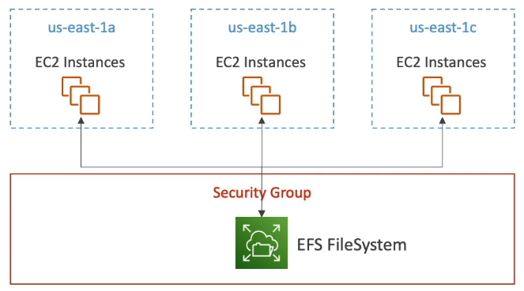
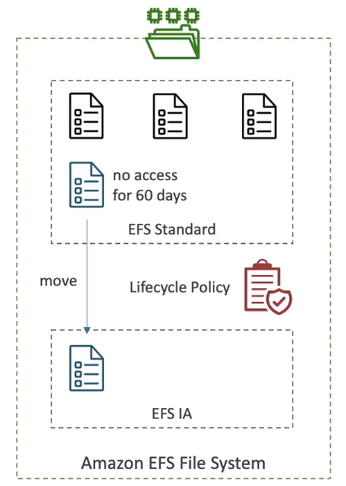

<!-- TOC -->
  * [Elastic File System(EFS)](#elastic-file-systemefs)
    * [Performance & Storage Classes](#performance--storage-classes)
<!-- TOC -->

### Elastic File System(EFS)

* Managed NFS(network file system) that can be mounted on many EC2.
* EFS works with EC2 instances in multi-AZ
* Highly available, scalable, expensive(3x gp2), pay per use.

* Use cases: content management, web serving, data sharing, Wordpress
* Uses NFSv4.1 protocol
* Uses security group to control access to EFS
* **Compatible with Linux based AMI (not Windows)**
* Encryption at rest using KMS
* POSIX file system(~Linux) that has a standard file API
* File system scales automatically, pay-per-use, no-capacity planning.

#### Performance & Storage Classes

* **EFS Scale**
  * 1000s of concurrent NFS client, 10 GB+ /s throughput
  * Grow to Petabyte-scale network file system, automatically
* **Performance Mode (set at EFS creation time)**
  * General Purpose (default) - latency-sensitive use cases(web server, CMS, etc...)
  * Max I/O - higher latency, throughput, highly parallel(big-data, media processing)
* **Throughput Mode**
  * **Bursting** - 1 TB = 50MiBs + burst of up to 100MiB/s
  * **Provisioned** - set your throughput regarless of storage size, ex: 1 GiB for 1 TB storage
  * **Elastic** - automatically scales throughput up or down based on your workloads
    * Up to 3GiB/s for reads and 1GiB/s for writes
    * Used for unpredictable workloads

* Storage Tiers (lifecycle management feature - move file after N days)
  * **Standard**: for frequently accessed files
  * **Infrequent access(EFS-1A)**: cost to retrieve files, lower price to store.
  * **Archive**: rarely accessed data(few times each year), 50% cheaper
  * Implement **lifecycle policies** to move files between storage tiers
  
* **Availability and durability**
  * **Standard**: Multi-AZ, great for prod
  * **One Zone**: One AZ, great for dev, backup enabled by default, compatible with 1A(EFS One Zone-1A)

* Over 90% in cost savings.

