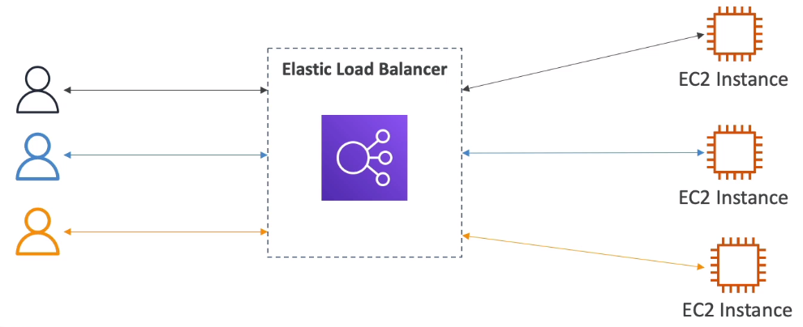
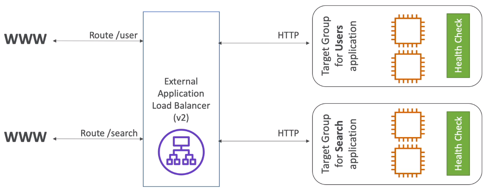
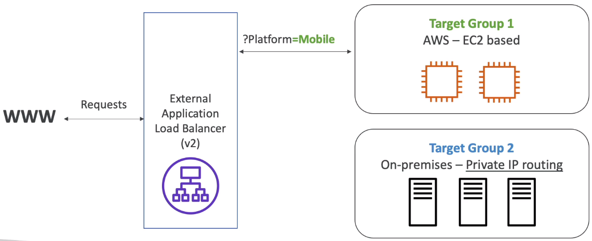
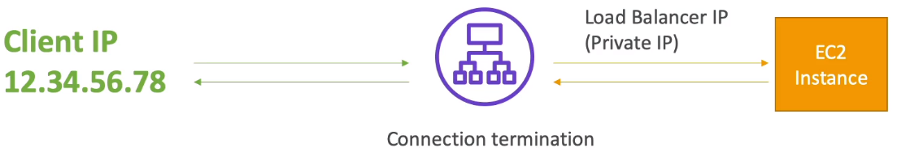
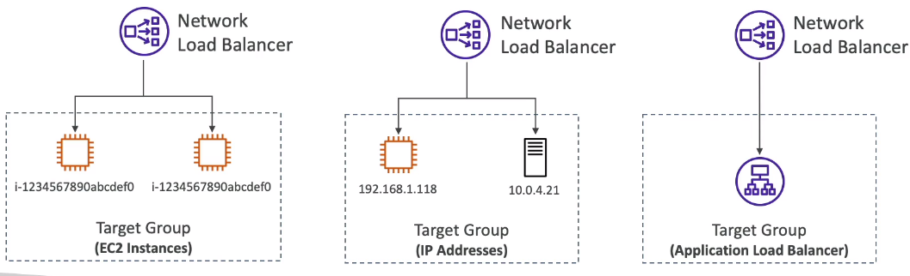

<!-- TOC -->
  * [What is load balancing?](#what-is-load-balancing)
    * [Why use a load balancer?](#why-use-a-load-balancer)
  * [Elastic Load Balancer](#elastic-load-balancer)
    * [Health Checks](#health-checks)
    * [Types](#types)
  * [Load Balancer Security Groups](#load-balancer-security-groups)
  * [Application Load Balancer(v2)](#application-load-balancerv2)
    * [Target Groups](#target-groups)
    * [Good to know](#good-to-know)
  * [Network Load Balancer](#network-load-balancer)
    * [Network Load Balancer - Target Groups](#network-load-balancer---target-groups)
  * [Gateways Load Balancer](#gateways-load-balancer)
  * [Sticky Sessions(Session Affinity)](#sticky-sessionssession-affinity)
    * [Sticky Sessions - Cookie Names](#sticky-sessions---cookie-names)
    * [Cross-Zone Load Balancing](#cross-zone-load-balancing)
      * [Application Load Balancer](#application-load-balancer)
      * [Network Load Balancer & Gateway Load Balancer](#network-load-balancer--gateway-load-balancer)
      * [Classic Load Balancer](#classic-load-balancer)
  * [SSL/TLS - Basics](#ssltls---basics)
    * [Load Balancer - SSL Certificates](#load-balancer---ssl-certificates)
    * [SSL - Server Name Indication(SNI)](#ssl---server-name-indicationsni)
  * [Elastic Load Balancers - SSL Certificates](#elastic-load-balancers---ssl-certificates)
  * [Connection Draining](#connection-draining)
  * [What's an Auto Scaling Group?](#whats-an-auto-scaling-group)
    * [Auto Scaling Group Attributes](#auto-scaling-group-attributes)
    * [Auto Scaling - CloudWatch Alarms & Scaling](#auto-scaling---cloudwatch-alarms--scaling)
    * [Auto Scaling Group - Scaling Policies](#auto-scaling-group---scaling-policies)
    * [Good metrics to scale on](#good-metrics-to-scale-on)
    * [Auto Scaling Groups - Scaling Cool downs](#auto-scaling-groups---scaling-cool-downs)
<!-- TOC -->

### What is load balancing?

* Load balancers are servers that forward traffic to multiple servers (e.g. EC2 instances) downstream.

#### Why use a load balancer?

* Spread load across multiple downstream instances
* Expose a single point of access(DNS) to your application
* Seamlessly handle failure of downstream instances
* Do regular health check to your instances
* Provide SSL termination (HTTPS) for your websites
* Enforce stickiness with cookies
* High availability across zones
* Separate public traffic from private traffic.

### Elastic Load Balancer

* An Elastic Load Balancer is a **managed load balancer**
  * AWS guarantees that it will be working
  * AWS takes care of upgrades, maintenance, high availability
  * AWS provides only a few configuration knobs

* It costs less to setup your own load balancer, but it will be a lot more effort on your end.

* It is integrated with many AWS offerings/services
  * EC2, EC2 Auto Scaling Group, Amazon ECS
  * AWS Certificate Manager(ACM), CloudWatch
  * Route 53, AWS WAF, AWS Global Accelerator

#### Health Checks

* Health checks are crucial for Load Balancers
* They enable the load balancer to know if instances it forwards traffic to are available to reply to requests
* The health check is done on a port and a route(/health is common)
* If the response is not 200(OKAY), then the instance is unhealthy

#### Types

* AWS has 4 kinds of managed Load Balancers
* **Classic Load Balancer** (v1 - old generation) - 2009 - CLB
  * HTTP, HTTPS, TCP, SSL (secure TCP)
* **Application Load Balancer** (v2 - new generation) - 2016 - ALB
  * HTTP, HTTPS, WebSocket
* **Network Load Balancer** (v2 - new generation) - 2017 - NLB
  * TCP, TLS (secure TCP), UDP
* **Gateway Load Balancer** - 2020 - GWLB
  * Operates at Layer 3 (Network Layer) - IP Protocol

* Overall, it is recommended to use the newer generation load balancers as they provide more features
* Some load balancers can be set as _internal_(private) or _external_(public) ELBs

### Load Balancer Security Groups

Here if your check closer the source of the ec2 which allows traffic only from Load Balancer.

### Application Load Balancer(v2)

* Application load balancers is Layer 7(HTTP)

* Load balancing to multiple HTTP applications across machines(target groups)
* Load balancing to multiple applications on the same machine(ex: containers)
* Support for HTTP/2 and WebSocket
* Support redirects (from HTTP to HTTPS for example)

* **Routing tables** to different target groups:
  * Routing based on path in URL(example.com/users & example.com/posts)
  * Routing based on hostname in URL(one.example.com & other.example.com)
  * Routing based on Query String, Headers
    * example.com/users?id=123&order=false

* ALB are a great fit for micro-services & container-based application(example: Docker & Amazon ECS)
* Has a port mapping feature to redirect to a dynamic port in ECS
* In comparison, we'd need multiple Classic Load Balancer per application

#### Target Groups

* EC2 instances (can be managed by an Auto Scaling Group) - HTTP
* ECS tasks (managed by ECS itself) - HTTP
* Lambda functions - HTTP request is translated into a JSON event
* IP Addresses - must be private IPs

* ALB can route to multiple target groups
* Health checks are at the target group level.

* Query String Routing

#### Good to know

* Fixed hostname(XXX.region.elb.amazonaws.com)
* The application server don't see the IP of the client directly
  * The true IP of the client is inserted in the header **X-Forwarded-For**
  * We can also get Port(X-Forwarded-Port) and proto(X-Forwarded-Proto)

### Network Load Balancer

* It allows:
  * Forward TCP & UDP traffic to your instances
  * Handle millions of request per seconds
  * Less Latency ~100 ms (vs 400 ms for ALB)
* NLB has **one static IP per AZ**, and supports assigning Elastic IP(helpful for whitelisting specific IP)
* NLB are used for extreme performance, TCP or UDP traffic
* Not included in the AWS free tier

#### Network Load Balancer - Target Groups

* EC2 instances
* IP Addresses - must be a private IPs
* Application Load Balancer
* Health Checks support the **TCP, HTTP and HTTPS Protocols**.

### Gateways Load Balancer

* Deploy, scale and manage fleet of 3rd party network virtual appliances in AWS
* Example: Firewalls, Intrusion Detection and Prevention Systems, Deep Packet Inspection Systems, payload manipulation...

* Operates at Layer 3 (Network Layer) - IP Packets
* Combines the following functions:
  * **Transparent Network Gateway** - single entry/exit for all traffic
  * **Load Balancer** - distributes traffic to your virtual appliances
* Uses the **GENEVE** protocol on port **6081**

### Sticky Sessions(Session Affinity)

* It is possible to implement stickiness so that the same client is always redirected to the same instance behind a load balancer.
* This works for **Classic Load Balancer, Application Load Balancer, and Network Load Balancer**
* The "cookie" used for stickiness has an expiration data you control
* Use case: make sure the user doesn't lose his session data
* Enabling stickiness may bring imbalancer to the load over the backend EC2 instances

#### Sticky Sessions - Cookie Names

* Application Based Cookies
  * Custom cookie
    * Generated by the target 
    * Can include any custom attributes required by the application
    * Cookie name must be specified individually for each target group
    * Don't use **AWSALB**, **AWSALBAPP**, or **AWSALBBTG**
  * Application cookie
    * Generated by the load balancer
    * Cookie name is **AWSALBAPP**
* Duration-based Cookies
  * Cookie generated by the load balancer
  * Cookie name is **AWSALB** for ALB, **AWSELB** for CLB

#### Cross-Zone Load Balancing

* With Cross Zone Load Balancing each load balancer instance distributes evenly across all registered instances in all AZ

* Without Cross Zone Load Balancing, requests are distributed in the instances of the node of the Elastic Load Balancer.

 

##### Application Load Balancer

* Enabled by default(can be disabled at the Target Group level)
* No charges for inter AZ data

##### Network Load Balancer & Gateway Load Balancer

* Disabled by default
* You pay charges for inter AZ data if enabled

##### Classic Load Balancer

* Disabled by default
* No charges for inter AZ data if enabled

### SSL/TLS - Basics

* An SSL Certificate allows traffic between your clients and your load balancer to be encrypted in transit(in-flight encryption)
* **SSL** refers to **Secure Sockets Layer**, used to encrypt connections
* **TLS** refers to **Transport Layer Security**, which is a new version
* Nowadays, **TLS certificates are mainly used**, but people still refer as SSL

* Public SSL certificate are issued by Certificate Authorities(CA)
* Comodo, Symantec, GoDaddy, GlobalSign, DigiCert, Letsencrypt, etc...

* SSL certificates have an expiration date(you set) and must be renewed.

#### Load Balancer - SSL Certificates

* The load balancer uses an X.509 certificates(SSL/TLS server certificate)
* You can manage certificates using ACM(AWS Certificate Manager)
* You can create upload your own certificates alternatively
* HTTPS listener:
  * You must specify a default certificate
  * You can add an optional list of certs to support multiple domains
  * Clients can use SNI(Server name Indication) to specify the hostname they reach
  * Ability to specify a security policy to support older version of SSL/TLS(legacy client)

#### SSL - Server Name Indication(SNI)

* SNI solves the problem of loading **multiple SSL certificates onto one web server**(to serve multiple websites)
* Its a newer protocol and requires the client to indicate the hostname of the target server in the initial SSL handshake.
* The server will then find the correct certificate, or return the default one.

Note: 
* Only works for ALB & NLB(newer generation), CloudFront
* Does not work for CLB(older gen)

### Elastic Load Balancers - SSL Certificates

* Classic Load Balancer(v1)
  * Support only one SSL certificates
  * Must use multiple CLB for multiple hostname with multiple SSL certificates
* Application Load Balancer(v2)
  * Support multiple listeners with multiple SSL certificates
  * Uses Server Name Indication(SNI) to make it work
* Network Load Balancer(v2)
  * Supports multiple listeners with multiple SSL certificates
  * Uses Server Name Indication(SNI) to make it work

### Connection Draining

* Feature naming
  * Connection Draining - for CLB
  * De-registration Delay - for ALB & NLB
* Time for complete "in-flight requests" while the instance is de-registering or unhealthy
* Stops sending new requests to the EC2 instance which is de-registering
* Between 1 and 3600 seconds(default 300 seconds)
* Can be disabled(set value to 0)
* Set to a low value if your requests are short

### What's an Auto Scaling Group?

* In real-life, the load on your websites and application can change
* In the cloud, you can create and get rid of servers very quickly

* The goal of an Auto Scaling Group (ASG) is to:
  * Scale out (add EC2 instances) to match an increased load
  * Scale in (remove EC2 instances) to match a decreased load
  * Ensure we have a minimum and a maximum number of EC2 instances running
  * Automatically register new instances to a load balancer
  * Re-create an EC2 instance in case a previous one is terminated (ex: if unhealthy)

* ASG are free(you pay of the underlying EC2 instances)

#### Auto Scaling Group Attributes

* A Launch Template(old "Launch Configuration" are deprecated)
  * AMI + Instance Type
  * EC2 User data
  * EBS Volumes
  * Security Group
  * SSH Key Pair
  * IAM Roles for your EC2 Instances
  * Network + Subnet Information
  * Load Balancer Information
* Min Size / Max Size / Initial capacity
* Scaling Policies

#### Auto Scaling - CloudWatch Alarms & Scaling

* It is possible to scale an ASG based on Cloud Watch alarms
* An alarm monitors a metric (such as Average CPU, or a custom metric)
* Metrics such as Average CPU are computed for the overall ASG instances
* Based on the alarm:
  * We can create scale-out policies(increase the number of instances)
  * We can create scale-in policies(decrease the number of instances)

#### Auto Scaling Group - Scaling Policies

* **Dynamic Scaling**
  * **Target Tracking Scaling**
    * Simple to set-up
    * Example: I want the average ASG CPU to stay at around 40%
  * **Simple/Step Scaling**
    * When a CloudWatch alarm is triggered(example CPU > 70%), then add 2 units
    * When a CloudWatch alarm is triggered(example CPU < 30%), then remove 1
* **Scheduled Scaling**
  * Anticipate a scaling based on known usage pattern
  * Example: increase the min capacity to 10 at 5 pm on Fridays
* **Predictive Scaling**
  * Continuously forecast load and schedule scaling ahead

#### Good metrics to scale on

* CPU Utilization: Average CPU utilization across your instances
* RequestCountPerTarget: to make sure the number of requests per EC2 instance is stable
* Average Network In/Out: If you're application is network bound
* Any custom metric: that you push using CloudWatch

#### Auto Scaling Groups - Scaling Cool downs

* After a scaling activity happens, you are in the **cool down period(default 300 seconds)**
* During the cool down period, the ASG will not launch or terminate additional instances(to all for metrics to stabilize)
* Advice: Use a ready-to-use AMI to reduce configuration time in order to be serving requests faster and reduce the cool down period

