### AWS Organizations

* Global service
* Allows to manage multiple AWS accounts
* The main account is the management account
* Other accounts are member accounts
* Member accounts can only be part of one organization
* Consolidated Billings across all accounts - single payment method
* Pricing benefits from aggregated usage(volume discount for EC2, S3...)
* **Shared reserved instances and Saving Plans discounts across accounts**
* API is available to automate AWS account creation

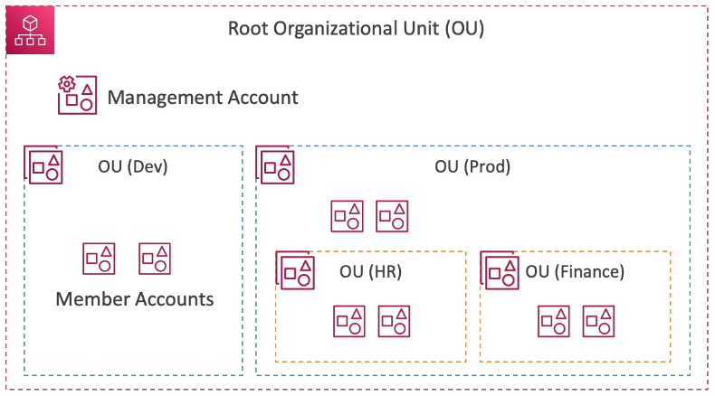

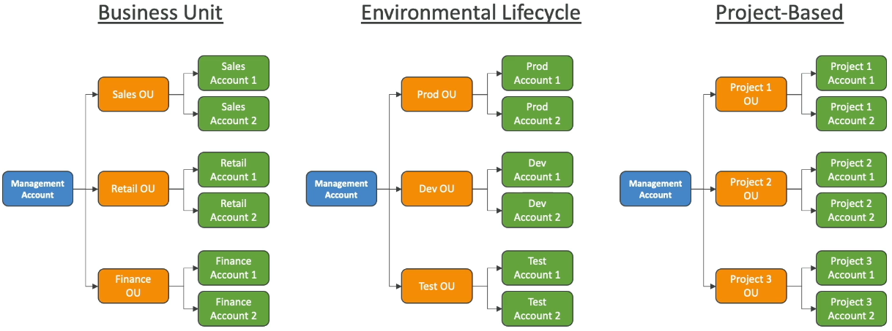

#### Advantages

* Multi Account vs One Account Multi VPC
* Use tagging standards for billing purposes
* Enable CloudTrail on all accounts, send logs to central S3 account
* Send CloudWatch Logs to central logging account
* Establish Cross Account Roles for Admin purposes

#### Security: Service Control Policies

* IAM policies applied to OU or Accounts to restrict Users and Roles
* They do not apply to the management account(full admin power)
* Must have an explicit allow from the root through each OU in the direct path to the target account(does not allow anything by default - like IAM)

#### SCP Hierarchy

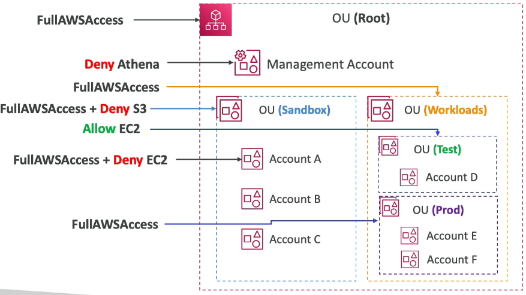

* Management Account
    * Can do anything(no SCP apply)
* Account A
    * Can do anything
    * Except S3
    * Execpt EC2
* Account B & C
    * Can do anything
    * Except S3
* Account D
    * Can access EC2
* Prod OU & Account E & F


### IAM - Advanced Policies

#### aws:SourceIp

* restrict the client IP from which the API calls are being made

```json
{
  "Version": "2012-10-17",
  "Statement": [
    {
      "Effect": "Deny",
      "Action": "*",
      "Resource": "*",
      "Condition": {
        "NotIpAddress": {
          "aws:SourceIp": ["192.0.2.0/24", "203.0.113.0/24"]
        }
      }
    }
  ]
}
```

#### aws:RequestedRegion

* restrict the region the API calls are made **to**

```json
{
  "Version": "2012-10-17",
  "Statement": [
    {
      "Effect": "Deny",
      "Action": [
        "ec2:*",
        "rds:*",
        "dynamodb:*"
      ],
      "Resource": "*",
      "Condition": {
        "StringEquals": {
          "aws:RequestedRegion": ["eu-central-1", "eu-west-1"]
        }
      }
    }
  ]
}
```

#### ec2:ResourceTag

* restrict based on tags

```json
{
  "Version": "2012-10-17",
  "Statement": [
    {
      "Effect": "Allow",
      "Action": [
        "ec2:startInstances",
        "ec2:StopInstances"
      ],
      "Resource": "arn:aws:ec2:us-east-1:123456789:instance/*",
      "Condition": {
        "StringEquals": {
          "ec2:ResourceTag/Project": "DataAnalytics",
          "aws:PricipalTag/Department": "Data"
        }
      }
    }
  ]
}
```

#### aws:MultiFactorAuthPresent

* to force MFA

```json
{
  "Version": "2012-10-17",
  "Statement": [
    {
      "Effect": "Allow",
      "Action": "ec2:*",
      "Resource": "*"
    },
    {
      "Effect": "Deny",
      "Action": [
        "ec2:StopInstances",
        "ec2:TerminateInstances"
      ],
      "Resource": "*",
      "Condition": {
        "BoolIfExists": {
          "aws:MultiFactorAuthPresent": false 
        }
      }
    }
  ]
}
```

#### IAM for S3

```json
{
  "Version": "2012-10-17",
  "Statement": [
    {
      "Effect": "Allow",
      "Action": [
        "s3:ListBucket"
      ],
      "Resource": "arn:aws:s3:::test"
    },
    {
      "Effect": "Allow",
      "Action": [
        "s3:PutObject",
        "s3:GetObject",
        "s3:DeleteObject"
      ],
      "Resource": "arn:aws:s3:::test/*"
    }
  ]
}
```

#### Resource Policies & aws:PrincipalOrgID

* **aws:PrincipalOrgId** can be used in any resource policies to restrict access to accounts that are member of an AWS organization

```json
{
  "Version": "2012-10-17",
  "Statement": [
    {
      "Effect": "Allow",
      "Action": [
        "s3:PutObject",
        "s3:GetObject"
      ],
      "Resource": "arn:aws:s3:::2022-financial-data/*",
      "Condition": {
        "StringEquals": {
          "aws:PrincipalOrgId": ["o-yyyyyyyyyyyy"]
        }
      }
    }
  ]
}
```


### Resource-based Policies vs IAM Roles

* Cross Account
  * attaching a resource-based policy to a resource(example: S3 bucket policy)
  * OR using a role as a proxy
    
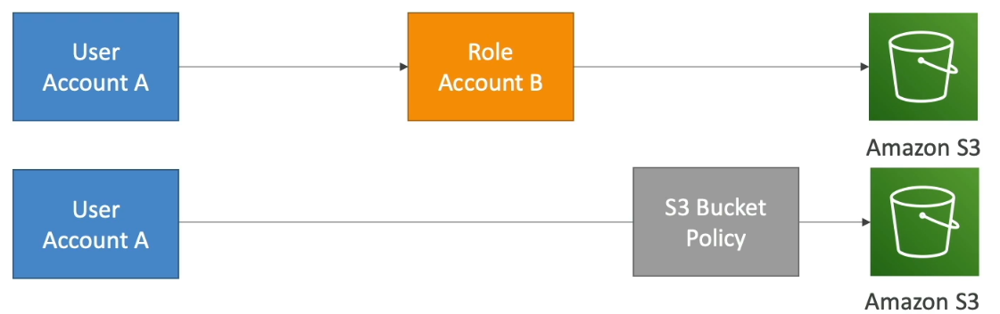

* **When you assume a role(user, application or service), you give up your original permissions and take the permissions assigned to the role**
* When using a resource-based policy, the principal doesn't have to give up his permission
* Example: user in account A need to scan a DynamoDB table in Account A and dump it in an S3 bucket in Account B
* Supported by: Amazon S3 buckets, SNS topics, SQS queues, etc...

#### Amazon EventBridge - Security

* When a rule runs, it needs permission on the target
* **Resource-based policy: Lambda, SQS, SNS, S3, API Gateway**
* **IAM role: Kinesis stream, Systems Manager Run Command, ECS task...**

### IAM Permission Boundaries

* IAM Permission Boundaries are supported for users and roles(**not groups**)
* Advanced featured to use a managed policy to set the maximum permissions an IAM entity can get.

Example:

* IAM Permission Boundary

```json
{
  "Version": "2012-10-17",
  "Statement": [
    {
      "Effect": "Allow",
      "Action": [
        "s3:*",
        "cloudwatch:*",
        "ec2:*"
      ],
      "Resource": "*"
    }
  ]
}
```

* IAM Permissions through IAM Policy

```json
{
  "Version": "2012-10-17",
  "Statement": {
    "Effect": "Allow",
    "Action": "iam:CreateUser",
    "Resource": "*"
  }
}
```

Together it offers no permissions

#### IAM Permission Boundaries

* Can be used in combinations of AWS Organizations SCP


_Use cases_

* Delegate responsibilities to non administrators within their permission boundaries, for example create new IAM users
* Allow developers to self-assign policies and manage their own permissions, while making sure they can't escalate their privileges(= make themselves admin)
* Useful to restrict one specific user(instead of a whole account using Organization & SCP)


#### Example IAM Policy

```json
{
  "Version": "2012-10-17",
  "Statement": [
    {
      "Action": "sqs:*",
      "Effect": "Deny",
      "Resource": "*"
    },
    {
      "Action": [
        "sqs:DeleteQueue"
      ],
      "Effect": "Allow",
      "Resource": "*"
    }
  ]
}
```

* Can you perform sqs:CreateQueue? No
* Can you perform sqs:DeleteQueue? No
* Can you perform ec2:DescribeInstances? No

### AWS IAM Identity Center

* One login (single sign-on) for all your
  * **AWS accounts in AWS Organizations**
  * Business cloud applications(e.g, Salesforce, Box, Microsoft 365,...)
  * SAML2.0-enabled applications
  * EC2 Windows Instances

* **Identity providers**
  * Built-in identity store in IAM identity Center
  * 3rd party: Active Directory(AD), OneLogin, Okta...

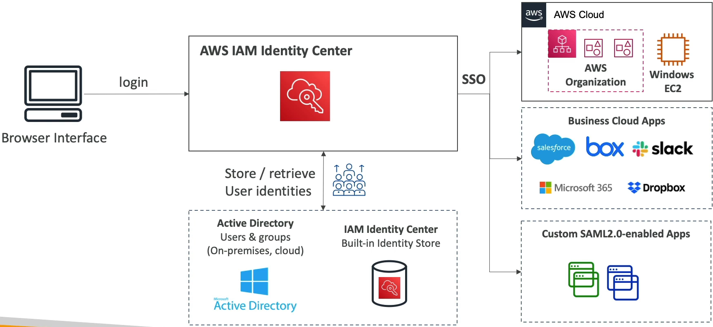

#### IAM identity Center

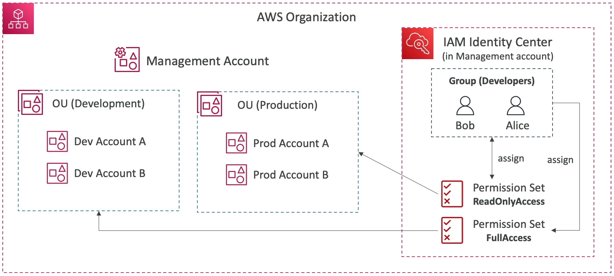

#### Fine-grained Permissions

* **Multi-Account Permissions**
  * Manage access across AWS accounts in your AWS Organization
  * Permission Sets - a collection of one or more IAM Policies assigned to users and groups to define AWS access
* **Application Assignments**
  * SSO access to many SAML 2.0 business application(Salesforce, Box, Microsoft 365,...)
  * Provide required URLs, certificates, and metadata
* **Attribute-Based Access Control(ABAC)**
  * Fine-grained permissions based on user's attributes stored in IAM Identity Center Identity Store
  * Example: cost center, title, locale...
  * Use case: Define permissions once, then modify AWS access by changing the attributes

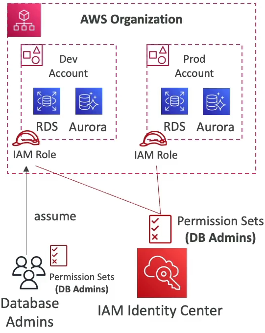

### What is Microsoft Active Directory(AD)

* Found on any Windows Server with AD Domain Services
* Database of **objects:** User Accounts, Computers, Printers, File Shares, Security Groups
* Centralized security management, create account, assign permissions
* Objects are organized in **trees**
* A group of trees is a **forest**

#### AWS Directory Services

* **AWS Managed Microsoft AD**
  * Create your own AD in AWS, manage users locally supports MFA
  * Establish "trust" connections with your on-premise AD
  
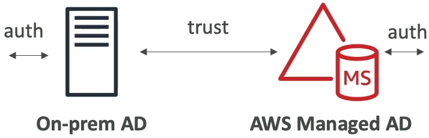

* **AD Connector**
  * Directory Gateway(proxy) to redirect to on-premise AD, supports MFA
  * Users are managed on the on-premise AD

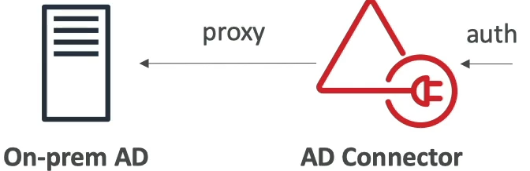

* **Simple AD**
  * AD-compatible managed directory on AWS
  * Cannot be joined with on-premise AD

#### IAM Identity Center - Active Directory Setup

* **Connect to an AWS Managed Microsoft AD**
  * Integration is out of the box

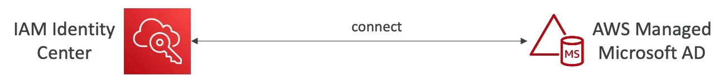

* **Connect to a Self-Managed Directory**
  * Create Two-way Trust Relationship using AWS Managed Microsoft AD
  * Create an AD Connector

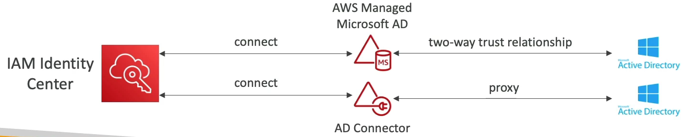


### AWS Control Tower

* Easy way to **set up and govern a secure and compliant multi-account AWS environment** based on best practices
* AWS Control Tower uses AWS Organizations to create accounts
* Benefits
  * Automate the set-up of your environment in a few clicks
  * Automate ongoing policy management using guardrails
  * Detect policy violations and remediate them
  * Monitor compliance through an interactive dashboard

#### AWS Control Tower - Guardrails

* Provides ongoing governance for your Control Tower environment(AWS Accounts)
* Preventive Guardrail - using SCP (e.g. Restrict Regions across all your accounts)
* Detective Guardrail - using AWS Config (e.g., identify untagged resources)

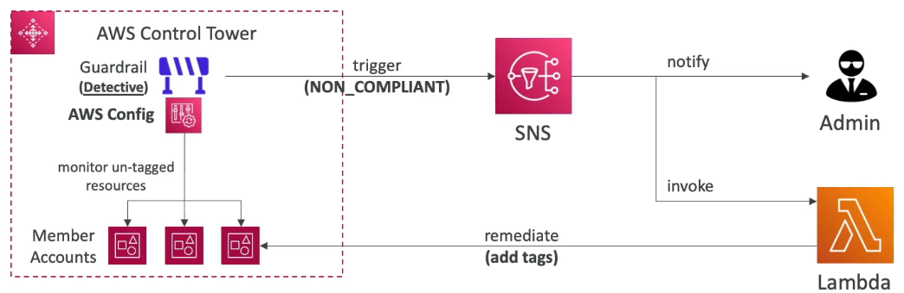