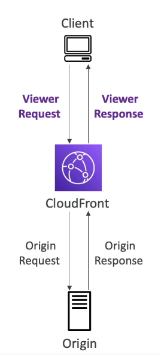
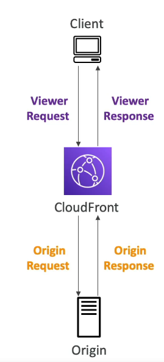

### What is serverless?

* The developers don't have to manage servers anymore
* They just deploy code
* Serverless was pioneered by AWS Lambda but now also includes anything that's managed: "databases, messaging, storage, etc."
* **Serverless does not mean there are no servers...**
  It means you just don't manage/ provision / see them

#### Serverless in AWS

* AWS Lambda
* DynamoDB
* AWS Cognito
* AWS API Gateway
* Amazon S3
* AWS SNS & SQS
* AWS Kinesis Data Firehose
* Aurora Serverless
* Step Functions
* Fargate

### Why AWS Lambda

* **EC2**:
  * Virtual Servers in the Cloud
  * Limited by RAM and CPU
  * Continuously running
  * Scaling means intervention to add/remove servers
* **Lambda**
  * Virtual **functions** - no servers to manage
  * Limited by time - **short executions**
  * Run **on-demand**
  * **Scaling is automated**

#### Benefits of AWS Lambda

* Easy pricing
  * Pay per request and compute time
  * Free tier of 1,000, 000 AWS Lambda requests and 400,000 GBs of compute time

* Integrated with the whole AWS suite of services
* Integrated with many programming languages
* Easy monitoring through AWS Cloudwatch
* Easy to get more resources per functions(up to 10GB of RAM)
* Increasing RAM will also improve CPU and network

#### AWS Lambda Language Support

* Node.js
* Python
* Java
* C# / Powershell
* Ruby
* Custom Runtime API(community supported, example Rust or Golang)

* Lambda Container Image
  * The container image must implement the Lambda Runtime API
  * ECS / Fargate is preferred for running arbitrary Docker images

#### AWS Lambda Limits to know - per region

* **Execution**
  * Memory allocation: 128MB - 10GB(1 MB increments)
  * Maximum execution time: 900 seconds(15 minutes)
  * Environment variables(4 KB)
* **Deployment**
  * Lambda function deployment size(compressed .zip): 50 MB
  * Size if uncompressed deployment(code + dependencies): 250 MB
  * Can use the **/tmp** directory to load other files at startup
  * Size of environment variables: 4 KB

#### Lambda SnapStart

* Improves your Lambda functions performance up to 10x at no extra cost for Java 11 and above
* When enabled, function is invoked from a pre-initialized state(no function initialization from scratch)
* When you publish a new version:
  * Lambda initializes your function
  * Takes a snapshot of memory and disk state of the initialized function
  * Snapshot is cached for low-latency access.

### Customization At the Edge

* Many modern applications execute some form of the logic at the edge
* **Edge Function:**
  * A code that you write and attach to CloudFront distributions
  * Runs close to your users to minimize latency
* CloudFront provides two types: **CloudFront Functions & Lambda@Edge**
* You don't have to manage any servers, it is deployed globally
* Use case: customize the CDN content.
* Pay only for what you use
* Fully serverless

#### CloudFront Functions & Lambda@Edge Use Case

* Website Security and Privacy
* Dynamic Web Application at the Edge
* Search Engine Optimization
* Intelligently Route Across Origins and Data Centers
* Bot Mitigation at the Edge
* Real-time Image Transformation
* A/B testing
* User Authentication and Authorization
* User Prioritization
* User Tracking and Analytics

#### CloudFront Functions

* Lightweight functions written in Javascript
* For high-scale, latency sensitive CDN customizations
* Sub-ms startup time, **millions of requests/second**
* Used to change Viewer requests and responses:
  * **Viewer Request:** after CloudFront receives a request from a viewer
  * **Viewer Response:** before CloudFront forwards the response to the viewer
* Native feature of CloudFront(**manage code entirely within CloudFront**)

#### Lambda@Edge

* Lambda functions written in NodeJS or Python
* Scales to **1000s of requests/second**
* Used to change CloudFront requests and responses:
  * **Viewer Request** - after CloudFront receives a request from a viewer
  * **Origin Request** - before CloudFront forwards the request to the origin
  * **Origin Response** - before CloudFront receives the response from the origin
  * **Viewer Response** - before CloudFront forwards the response to the viewer
* Author your function in one AWS Regions(us-east-1), then CloudFront replicates to its location

|                                    | CloudFront Functions                    | Lambda@Edge                                              |
|------------------------------------|-----------------------------------------|----------------------------------------------------------|
| Runtime Support                    | JavaScript                              | Node.js, Python                                          |
| # of Requests                      | **Millions** of requests per second     | Thousands of requests per second                         |
| CloudFront Triggers                | - Viewer Request/Response               | - Viewer Request/Response  - Origin Request/Response |
| Max. Execution Time                | < 1 ms                                  | 5-10 seconds                                             |
| Max. Memory                        | 2 MB                                    | 128 MB up to 10 GB                                       |
| Total Package Size                 | 10 KB                                   | 1 MB - 50 MB                                             |
| Network Access, File System Access | **No**                                  | Yes                                                      |
| Access to the Request Body         | **No**                                  | Yes                                                      |
| Pricing                            | Free tier available 1/6th price of Edge | No free tier, charged per request & duration             |

#### CloudFront Functions vs Lambda@Edge - Use Cases

* CloudFront Functions
  * Cache Key normalization
    * Transform request attribute(headers, cookies, query strings, URL) to create an optimal Cache Key
  * Header manipulation
    * Insert/modify/delete HTTP headers in the request or response
  * URL rewrites or redirects
  * Request authentication & authorization
  * Create and validate user-generated tokens(e.g. JWT) to allow/deny requests

* Lambda@Edge
  * Longer execution time(several ms)
  * Adjustable CPU or memory
  * Your code depends on a 3rd libraries(e.g., AWS SDK to access other AWS services)
  * Network access to use external services for processing
  * File system access or access to the body of HTTP requests
