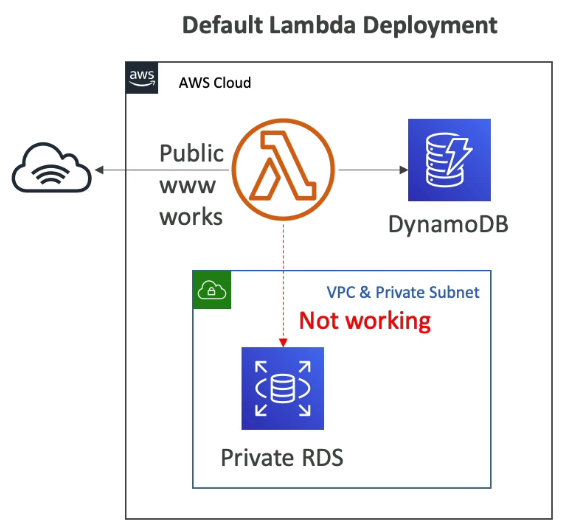

<!-- TOC -->
  * [What is serverless?](#what-is-serverless)
    * [Serverless in AWS](#serverless-in-aws)
  * [Why AWS Lambda](#why-aws-lambda)
    * [Benefits of AWS Lambda](#benefits-of-aws-lambda)
    * [AWS Lambda Language Support](#aws-lambda-language-support)
    * [AWS Lambda Limits to know - per region](#aws-lambda-limits-to-know---per-region)
    * [Lambda SnapStart](#lambda-snapstart)
  * [Customization At the Edge](#customization-at-the-edge)
    * [CloudFront Functions & Lambda@Edge Use Case](#cloudfront-functions--lambdaedge-use-case)
    * [CloudFront Functions](#cloudfront-functions)
    * [Lambda@Edge](#lambdaedge)
    * [CloudFront Functions vs Lambda@Edge - Use Cases](#cloudfront-functions-vs-lambdaedge---use-cases)
  * [Lambda by default](#lambda-by-default)
    * [Lambda is VPC](#lambda-is-vpc)
    * [Lambda with RDS Proxy](#lambda-with-rds-proxy)
  * [RDS Invoking Lambda & Event Notifications](#rds-invoking-lambda--event-notifications)
    * [RDS Event Notifications](#rds-event-notifications)
  * [API Gateway](#api-gateway)
    * [API Gateway - Integrations High Level](#api-gateway---integrations-high-level)
    * [API Gateway - AWS Service Integration - Kinesis Data Streams Example](#api-gateway---aws-service-integration---kinesis-data-streams-example)
    * [API Gateway - Endpoint Types](#api-gateway---endpoint-types)
    * [API Gateway - Security](#api-gateway---security)
  * [Amazon Cognito](#amazon-cognito-)
    * [Cognito User Pools(CUP) - User Features](#cognito-user-poolscup---user-features)
    * [Cognito Identity Pools (Federated Identities)](#cognito-identity-pools-federated-identities)
    * [Row Level Security in DynamoDB](#row-level-security-in-dynamodb)
<!-- TOC -->

### What is serverless?

* The developers don't have to manage servers anymore
* They just deploy code
* Serverless was pioneered by AWS Lambda but now also includes anything that's managed: "databases, messaging, storage, etc."
* **Serverless does not mean there are no servers...**
  It means you just don't manage/ provision / see them

#### Serverless in AWS

* AWS Lambda
* DynamoDB
* AWS Cognito
* AWS API Gateway
* Amazon S3
* AWS SNS & SQS
* AWS Kinesis Data Firehose
* Aurora Serverless
* Step Functions
* Fargate

### Why AWS Lambda

* **EC2**:
  * Virtual Servers in the Cloud
  * Limited by RAM and CPU
  * Continuously running
  * Scaling means intervention to add/remove servers
* **Lambda**
  * Virtual **functions** - no servers to manage
  * Limited by time - **short executions**
  * Run **on-demand**
  * **Scaling is automated**

#### Benefits of AWS Lambda

* Easy pricing
  * Pay per request and compute time
  * Free tier of 1,000, 000 AWS Lambda requests and 400,000 GBs of compute time

* Integrated with the whole AWS suite of services
* Integrated with many programming languages
* Easy monitoring through AWS Cloudwatch
* Easy to get more resources per functions(up to 10GB of RAM)
* Increasing RAM will also improve CPU and network

#### AWS Lambda Language Support

* Node.js
* Python
* Java
* C# / Powershell
* Ruby
* Custom Runtime API(community supported, example Rust or Golang)

* Lambda Container Image
  * The container image must implement the Lambda Runtime API
  * ECS / Fargate is preferred for running arbitrary Docker images

#### AWS Lambda Limits to know - per region

* **Execution**
  * Memory allocation: 128MB - 10GB(1 MB increments)
  * Maximum execution time: 900 seconds(15 minutes)
  * Environment variables(4 KB)
* **Deployment**
  * Lambda function deployment size(compressed .zip): 50 MB
  * Size if uncompressed deployment(code + dependencies): 250 MB
  * Can use the **/tmp** directory to load other files at startup
  * Size of environment variables: 4 KB

#### Lambda SnapStart

* Improves your Lambda functions performance up to 10x at no extra cost for Java 11 and above
* When enabled, function is invoked from a pre-initialized state(no function initialization from scratch)
* When you publish a new version:
  * Lambda initializes your function
  * Takes a snapshot of memory and disk state of the initialized function
  * Snapshot is cached for low-latency access.

### Customization At the Edge

* Many modern applications execute some form of the logic at the edge
* **Edge Function:**
  * A code that you write and attach to CloudFront distributions
  * Runs close to your users to minimize latency
* CloudFront provides two types: **CloudFront Functions & Lambda@Edge**
* You don't have to manage any servers, it is deployed globally
* Use case: customize the CDN content.
* Pay only for what you use
* Fully serverless

#### CloudFront Functions & Lambda@Edge Use Case

* Website Security and Privacy
* Dynamic Web Application at the Edge
* Search Engine Optimization
* Intelligently Route Across Origins and Data Centers
* Bot Mitigation at the Edge
* Real-time Image Transformation
* A/B testing
* User Authentication and Authorization
* User Prioritization
* User Tracking and Analytics

#### CloudFront Functions

* Lightweight functions written in Javascript
* For high-scale, latency sensitive CDN customizations
* Sub-ms startup time, **millions of requests/second**
* Used to change Viewer requests and responses:
  * **Viewer Request:** after CloudFront receives a request from a viewer
  * **Viewer Response:** before CloudFront forwards the response to the viewer
* Native feature of CloudFront(**manage code entirely within CloudFront**)

#### Lambda@Edge

* Lambda functions written in NodeJS or Python
* Scales to **1000s of requests/second**
* Used to change CloudFront requests and responses:
  * **Viewer Request** - after CloudFront receives a request from a viewer
  * **Origin Request** - before CloudFront forwards the request to the origin
  * **Origin Response** - before CloudFront receives the response from the origin
  * **Viewer Response** - before CloudFront forwards the response to the viewer
* Author your function in one AWS Regions(us-east-1), then CloudFront replicates to its location

|                                    | CloudFront Functions                    | Lambda@Edge                                              |
|------------------------------------|-----------------------------------------|----------------------------------------------------------|
| Runtime Support                    | JavaScript                              | Node.js, Python                                          |
| # of Requests                      | **Millions** of requests per second     | Thousands of requests per second                         |
| CloudFront Triggers                | - Viewer Request/Response               | - Viewer Request/Response  - Origin Request/Response |
| Max. Execution Time                | < 1 ms                                  | 5-10 seconds                                             |
| Max. Memory                        | 2 MB                                    | 128 MB up to 10 GB                                       |
| Total Package Size                 | 10 KB                                   | 1 MB - 50 MB                                             |
| Network Access, File System Access | **No**                                  | Yes                                                      |
| Access to the Request Body         | **No**                                  | Yes                                                      |
| Pricing                            | Free tier available 1/6th price of Edge | No free tier, charged per request & duration             |

#### CloudFront Functions vs Lambda@Edge - Use Cases

* **CloudFront Functions**
  * Cache Key normalization
    * Transform request attribute(headers, cookies, query strings, URL) to create an optimal Cache Key
  * Header manipulation
    * Insert/modify/delete HTTP headers in the request or response
  * URL rewrites or redirects
  * Request authentication & authorization
  * Create and validate user-generated tokens(e.g. JWT) to allow/deny requests

* **Lambda@Edge**
  * Longer execution time(several ms)
  * Adjustable CPU or memory
  * Your code depends on a 3rd libraries(e.g., AWS SDK to access other AWS services)
  * Network access to use external services for processing
  * File system access or access to the body of HTTP requests

### Lambda by default

* By default, you Lambda function is launched outside your own VPC(in an AWS-owned VPC)
* Therefore, it cannot access resources in your VPC(RDS, ElasticCache, internal ELB...)

#### Lambda is VPC

* You must define the VPC ID, the Subnets and the Security Groups
* Lambda will create an ENI(**Elastic Network Interface**) in your subnets.

#### Lambda with RDS Proxy

* If Lambda functions directly access your database, they many open too many connections under high load
* RDS Proxy
  * Improve scalability by pooling and sharing DB connections
  * Improve availability by reducing by 66% the failover time  and preserving connections
  * Improve security by enforcing IAM authentication and storing credentials in Secrets Manager.
* **The Lambda function must be deployed in your VPC, because RDS Proxy is never publicly accessible**

### RDS Invoking Lambda & Event Notifications

* Invoke Lambda functions from within your DB instance
* Allows you to process **data events** from within a database
* Supported for **RDS for PostgreSQL and Aurora MySQL**
* **Must allow outbound traffic to your Lambda function** from within you DB instance(Public, NAT GW, VPC Endpoints)
* **DB instance must have the required permissions to invoke the Lambda function** (Lambda Resource-based Policy & IAM Policy)

#### RDS Event Notifications

* Notifications that tells information about the DB instance itself(created, stopped, start,...)
* You don't have any information about the data itself
* Subscribe to the following event categories: **DB instance, DB snapshot, DB Parameter Group, DB Security Group, RDS Proxy, Custom Engine Version**
* Near real-time events(up to 5 minutes)
* Send notifications to SNS or subscribe to events using EventBridge

### API Gateway

* AWS Lambda + API Gateway: No infrastructure to manage
* Support for the WebSocket Protocol
* Handle API versioning(v1, v2...)
* Handle different environments(dev, test, prod...)
* Handle security(Authentication and Authorization)
* Create API keys, handle request throttling
* Swagger / Open API import to quickly define APIs
* Transform and validate requests and responses
* Generate SDK and API specifications
* Cache API responses.

#### API Gateway - Integrations High Level

* **Lambda Function**
  * Invoke Lambda function
  * Easy way to expose REST API backed by AWS Lambda
* **HTTP**
  * Expose HTTP endpoints in the backend
  * Example: internal HTTP API on premise, Application Load Balancer...
  * Why? Add rate limiting, caching, user authentication, API Keys, etc
* **AWS Service**
  * Expose any AWS API through the API Gateways?
  * Example: start an AWS Step function workflow, post a message to SQS
  * Why? Add Authentication, deploy publicly, rate control...

#### API Gateway - AWS Service Integration - Kinesis Data Streams Example

#### API Gateway - Endpoint Types

* **Edge-Optimized:** For global clients
  * Requests are routed through the CloudFront Edge Locations(improves latency)
  * The API Gateway still lives in only one region
* **Regional**
  * For clients within the same region
  * Could manually combine with CloudFront(more control over the caching strategies and the distribution)
* **Private**
  * Can only be accessed from your VPC using an interface VPC endpoint(ENI)
  * Use a resource policy to define access

#### API Gateway - Security

* **User Authentication through**
  * IAM Roles(useful for internal applications)
  * Cognito(identity for external users - example mobile users)
  * Custom Authorizer(your own logic)
* **Custom Domain Name HTTPS** security through integration with AWS Certificate Manager(ACM)
  * If using Edge-Optimized endpoint, then the certificate must be in **us-east-1**
  * If using Regional endpoint, the certificate must be in the API Gateway region
  * Must set up CNAME or A-alias record in Route 53

### Amazon Cognito 

* Give users an identity to interact with our web or mobile application

* **Cognito User Pools**
  * Sign-in functionality for app users
  * Integrate with API Gateway & Application Load Balancer
* **Cognito Identity Pools(Federated Identity)**
  * Provide AWS credentials to users, so they can access AWS resources directly
  * Integrate with Cognito User Pools as an Identity Provider
* **Cognito vs IAM:** "Hundreds of user", "mobile users", "authenticate with SAML"

#### Cognito User Pools(CUP) - User Features

* **Create a serverless database of user for your web & mobile apps**
* Simple login: Username(or email)/ password combination
* Password reset
* Email & Phone Number verification
* Multi-factor authentication(MFA)
* Federated Identities: users from Facebook, Google, SAML...

* CUP integrates with **API Gateway** & **Application Load Balancer**

#### Cognito Identity Pools (Federated Identities)

* **Get identities for "users" so they obtain temporary AWS credential**
* Users source can be Cognito User Pools, 3rd party logins, etc...

* **Users can then access AWS services directly or through API Gateway**
* The IAM policies applied to the credentials are defined in Cognito
* They can be customized based on the user_id for fine-grained control
* **Default IAM roles** for authenticated and guest users

#### Row Level Security in DynamoDB

