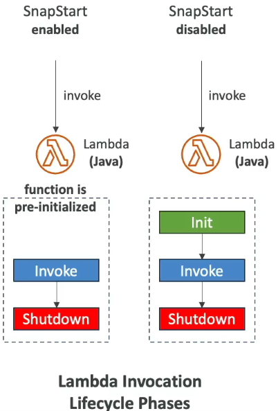

### What is serverless?

* The developers don't have to manage servers anymore
* They just deploy code
* Serverless was pioneered by AWS Lambda but now also includes anything that's managed: "databases, messaging, storage, etc."
* **Serverless does not mean there are no servers...**
  It means you just don't manage/ provision / see them

#### Serverless in AWS

* AWS Lambda
* DynamoDB
* AWS Cognito
* AWS API Gateway
* Amazon S3
* AWS SNS & SQS
* AWS Kinesis Data Firehose
* Aurora Serverless
* Step Functions
* Fargate

### Why AWS Lambda

* **EC2**:
  * Virtual Servers in the Cloud
  * Limited by RAM and CPU
  * Continuously running
  * Scaling means intervention to add/remove servers
* **Lambda**
  * Virtual **functions** - no servers to manage
  * Limited by time - **short executions**
  * Run **on-demand**
  * **Scaling is automated**

#### Benefits of AWS Lambda

* Easy pricing
  * Pay per request and compute time
  * Free tier of 1,000, 000 AWS Lambda requests and 400,000 GBs of compute time

* Integrated with the whole AWS suite of services
* Integrated with many programming languages
* Easy monitoring through AWS Cloudwatch
* Easy to get more resources per functions(up to 10GB of RAM)
* Increasing RAM will also improve CPU and network

#### AWS Lambda Language Support

* Node.js
* Python
* Java
* C# / Powershell
* Ruby
* Custom Runtime API(community supported, example Rust or Golang)

* Lambda Container Image
  * The container image must implement the Lambda Runtime API
  * ECS / Fargate is preferred for running arbitrary Docker images

#### AWS Lambda Limits to know - per region

* **Execution**
  * Memory allocation: 128MB - 10GB(1 MB increments)
  * Maximum execution time: 900 seconds(15 minutes)
  * Environment variables(4 KB)
* **Deployment**
  * Lambda function deployment size(compressed .zip): 50 MB
  * Size if uncompressed deployment(code + dependencies): 250 MB
  * Can use the **/tmp** directory to load other files at startup
  * Size of environment variables: 4 KB

#### Lambda SnapStart

* Improves your Lambda functions performance up to 10x at no extra cost for Java 11 and above
* When enabled, function is invoked from a pre-initialized state(no function initialization from scratch)
* When you publish a new version:
  * Lambda initializes your function
  * Takes a snapshot of memory and disk state of the initialized function
  * Snapshot is cached for low-latency access.

=================================================================================================================
### AWS Lambda

* Run code **without provisioning or managing** servers.
* Servers automatically start and stop when needed.
* **Serverless Functions**
* **Pay per invocation**.

### Intro

* AWS Lambda is a compute service that lets you run code **without provisioning or managing** servers.
* Lambda executes your code only when needed and scales automatically to a **few to a 1000** lambda functions concurrently in seconds.
* You pay only for the compute time you consume - there is no charge when your code is not running.
* Lambda is **Cheap**
* Lambda is **Serverless**
* Lambda **Scales Automatically**

**Supported Language**
1. Ruby
2. Python
3. Java
4. Go
5. Powershell
6. NodeJS
7. C#

You can also create your own **custom runtime** environment.

### Use cases

* Lambda is commonly used to **glue different services together** so the use cases are endless.

**Processing Thumbnails**

A web-service allows users to upload their profile photo. They are stored in an S3 bucket. We can setup an Event Trigger which will invoke a Lambda which will process the Profile Photo into a Thumbnail and store it back in the bucket.

**Contact Email Form**

A company has a contact email form which submits form data via API Gateway Endpoint. That endpoint triggers a lambda which validates the form dat and if valid will save the submission in DynamoDB and send and email notification via SNS to the company.

### Triggers

* Lambdas can be invoked via the AWS SDK or trigger from other AWS Services.

* Lambdas third party trigger

### Pricing

* First **1 million requests** per month are free. 
* There-after **$0.20** per additional 1 million requests.

* **400, 000 GB seconds** free per month
* Thereafter, **$0.0000166667** for every GB second

* ** This price will vary on the amount of memory you allocate
* 128MB of Memory * 30M executed per month * 20ms run time per invocation = **$5.83**

### Lambda Interface

### Defaults and Limits

* By default, you can have 1000 Lambda running concurrently(Ask AWS support for Limit Increase)
* /tmp directory can contain up to **500MB**
* By default, Lambda run in **No VPC**. You can set them to by in your own VPC but your lambda will lose internet access.
* You can set timeout to be a maximum of **15 minutes**
* Memory can be set between **128MB** to a Maximum of **3008MB** at an increment of **64MB**

### Cold Starts

* AWS has servers preconfigured(just sitting around turned off) for your runtime environment. When a Lambda is invoked these servers need to be turned on and your code needs to be copied over.
* During the time there will be a delay when the function will initially run which is caled a **Cold Start**
* If the same Lambda is invoked and the server is still running it will use that server again, so there will be little to delay to running that function. This what we call a **Warm Server**
* Serverless functions are **cheap** but everything comes with a trade off. Serverless functions Cold Starts can **cause delay in the User Experience.** If you web-application relies on being very responsive, then you want to reconsider Serverless Functions.
* There are strategies around Cold Start such as **Pre Warming** which keep servers continously running Cloud providers are always looking for ways to reduce cold starts.

### CheatSheet

* Lambda's are serverless functions. You upload your code and it runs without you managing or provisioning any servers.
* Lambda's is serverless. You don't need to worry about underlying architecture.
* Lambda is a good fit for short running tasks where you don't need to customize the OS enviornment. if you need along running tasks(> 15 mins) and a custom OS environemtn than consider using **Fargate**
* 7 Runtim supported: **Ruby, Python, Java, NodeJS, C#, Powershell, and GO**
* You pay per invocation
* You can adjust the duration timeout for up to 15 mins and memory up to **3008 MB**
* You can trigger Lambdas from the SDK or multiple AWS services.
* Lambdas by default run in No VPC. To interact with some services you need to have your Lambda in the same VPC eg. RDS
* Lambdas can scale to **1000 of concurrent functions** in seconds.
* Lambdas have **Cold Starts.** If a function has not been recently been execute there will be a delay.