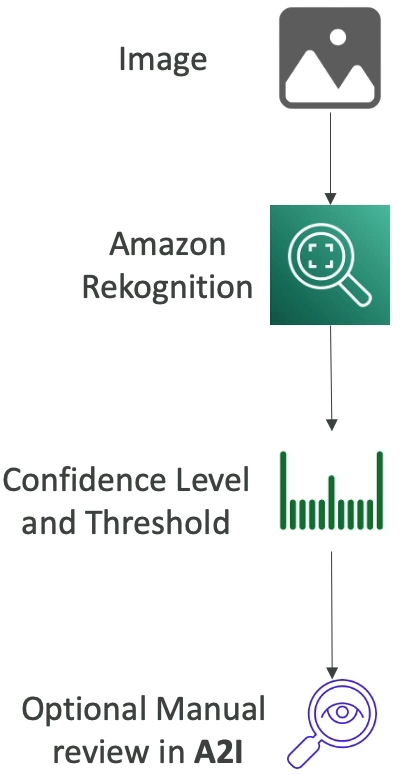
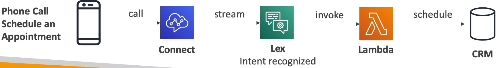
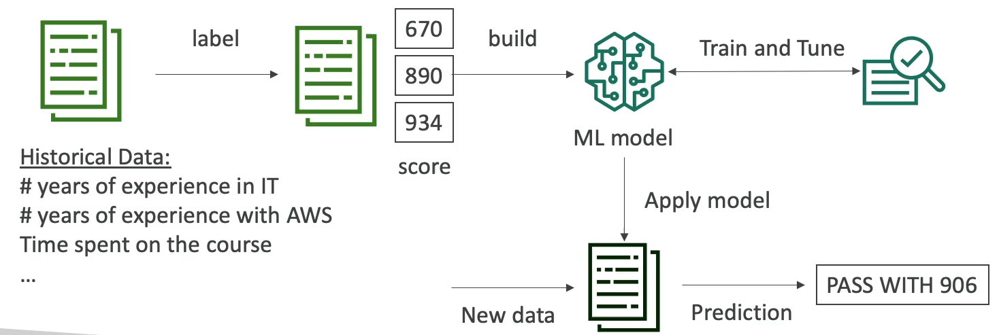
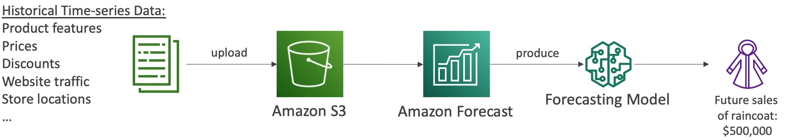

<!-- TOC -->
  * [Amazon Rekognition](#amazon-rekognition)
    * [Amazon Rekognition - Content Moderation](#amazon-rekognition---content-moderation)
  * [Amazon Transcribe](#amazon-transcribe)
  * [Amazon Polly](#amazon-polly)
  * [Translate](#translate-)
  * [Lex + Connect Overview](#lex--connect-overview)
  * [Amazon Comprehend](#amazon-comprehend)
    * [Amazon Comprehend Medical](#amazon-comprehend-medical)
  * [Sagemaker](#sagemaker)
  * [Forecast](#forecast)
  * [Kendra](#kendra)
  * [Personalize](#personalize-)
  * [Textract](#textract)
<!-- TOC -->

### Amazon Rekognition

* Find objects, people, text, scenes in images and videos using ML
* Facial analysis and Facial search to do user verification, people counting
* Create a database of "familiar faces" or compare against celebrities
* Use cases:
  * Labeling
  * Content Moderation
  * Text Detection
  * Face Detection and Analysis(gender, age range, emotions...)
  * Face Search and Verification
  * Celebrity Recognition
  * Pathing(ex: for sports game analysis)

#### Amazon Rekognition - Content Moderation

* Detect content that is inappropriate, unwanted, or offensive(images and videos)
* Used in social media, broadcast media, advertising, and e-commerce situations to create a safer user experience
* **Set a Minimum Confidence Threshold for items that will be flagged**
* Flag sensitive content for manual review in Amazon Augmented AI(A2I)
* Help comply with regulations.

### Amazon Transcribe

* Automatically **convert speech to text**
* Uses a **deep learning process** called **automatic speech recognition (ASR)** to convert speech to text quickly and accurately
* **Automatically remove Personally Identifiable Information(PII)** using **Redaction**
* **Supports Automatic Language Identification for multi-lingual audio**
* Use cases:
  * transcribe customer service calls
  * automate closed captioning and subtitling
  * generate metadata for media assets to create a full searchable archive.

### Amazon Polly

* Customize the pronunciation of words with **Pronunciation lexicons**
  * Stylized words: St3ph4ne => Stephane
  * Acronyms: AWS => "Amazon Web Services"
* Upload the lexicons and use them in the **SynthesizeSpeech** operation

* Generate speech from plain text or from documents marked up with **Speech Synthesis Markup Language (SSML)** - enables more customization
  * emphasizing specific words or phrases
  * using phonetic pronunciation
  * including breathing sounds, whispering
  * using the Newscaster speaking style.

### Translate 

 * Natural and accurate **language translation**
 * Amazon Translate allows you to **localize content** - such as websites and applications - for **internation users,** and to easily translate large volumes of text efficiently.

### Lex + Connect Overview

* Amazon Lex: (same technology the powers Alexa)
  * Automatic Speech Recognition(ASR) to convert speech to text
  * Natural Language Understanding to recognize the intent of text, callers
  * Helps build chatbots, cell center bots
* Amazon Connect:
  * Receive calls, create contact flows, cloud-based virtual contact center
  * Can integrate with other CRM systems or AWS
  * No upfront payments, 80% cheaper than traditional contact center solutions

### Amazon Comprehend

* For **Natural Language Processing - NLP**
* Fully managed and serverless service
* Uses machine learning to find insights and relationships in text
  * Language of the text
  * Extracts key phrases, places, people, brands or events
  * Understands how positive or negative the text is
  * Analyzes text using tokenization and parts of speech
  * Automatically organizes a collection of text files by topic
* Sample use cases:
  * analyze customer interaction(emails) to find what leads to a positive or negative experience
  * Create and groups articles by topics that Comprehend will uncover

#### Amazon Comprehend Medical

* Amazon Comprehend Medical detects and returns useful information in unstructured clinical text
  * Physician's Notes
  * Discharge summaries
  * Test results
  * Case notes
* **Uses NLP to detect Protected Health Information (PHI)** - DetectPHI API
* Store your documents in Amazon S3, analyze real-time data with Kinesis Data Firehose, or use Amazon Transcribe patient narratives into text that can be analyzed by Amazon Comprehend Medical.

### Sagemaker

* Fully managed server for developers / data scientists to build ML models
* Typically difficult to do all the processing in one place + provision servers
* Machine learning process(simplified): predicting you example

### Forecast

* Fully managed service that uses ML to deliver highly accurate forecasts
* Example: predict the future sales of a raincoat
* 50% more accurate than looking at the data itself
* Reduce forecasting time from months to hours
* Use cases: Product Demand Planning, Financial Planning, Resource Planning...

### Kendra

* Fully managed **document search service** powered by Machine Learning
* Extract answers from within a document(text, pdf, HTML, PowerPoint, MS Word, FAQs...)
* Natural language search capabilities
* Learn from user interactions/feedback to promote preferred result(Incremental learning)
* Ability to manually fine-tune search results(importance of data, freshness, custom,...)

### Personalize 

* Fully managed ML-service to build apps with real-time personalized recommendataions
* Example: personalized product recommendations/re-ranking, customized direct marketing
  * Example: User bought gardening tools, provide recommendations on the next one to bug
* Same technology used by Amazon.com
* Integrates with existing websites, application, SMS, email marketing systems...
* Implement in days, not months
* Use case: retail stores, media, and entertainment...

### Textract

* Automatically extracts text, handwriting, and data from any scanned documents using AI and ML
* Extract data from forms and tables
* Read and process any type of documents(PDFs, images,...)
* Use cases:
  * Financial Services (e.g., invoices, financial reports)
  * Healthcare (e.g., medical records, insurance claims)
  * Public Sector (e.g., tax forms, ID documents, passports)