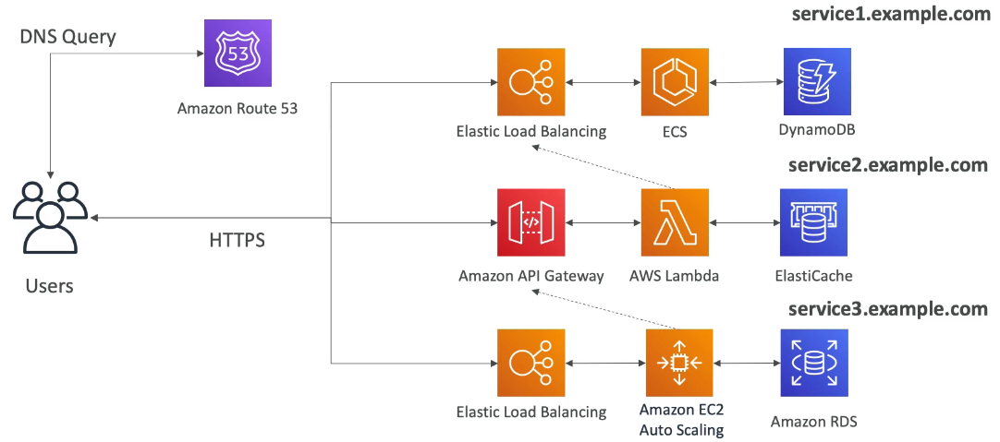

### Micro Services Architecture

* We want to switch to a microservice architecture
* Many services interact with each other directly using a REST API
* Each architecture for each microservice may vary in form and shape

* We want a microservice architecture so we can have a leaner development lifecycle for each service

#### Micro Services Environment

* You are free to design each microservice the way you want
* Synchronous patterns: API Gateway, Load Balancers
* Asynchronous patterns: SQS, Kinesis, SNS, Lambda triggers(S3)
* Challenges with microservices:
  * repeated overhead for creating each new microservices
  * issues with optimizing server density/utilization
  * complexity of running multiple versions of multiple microservices simultaneously
  * proliferation of client-side code requirements to integrate with many separate services
* Some of the challenges are solved by serverless patterns:
  * API Gateway, Lambda scale automatically and you pay per usage
  * You can easily clone API, reproduce environments
  * Generated client SDK through Swagger integration for the API Gateway