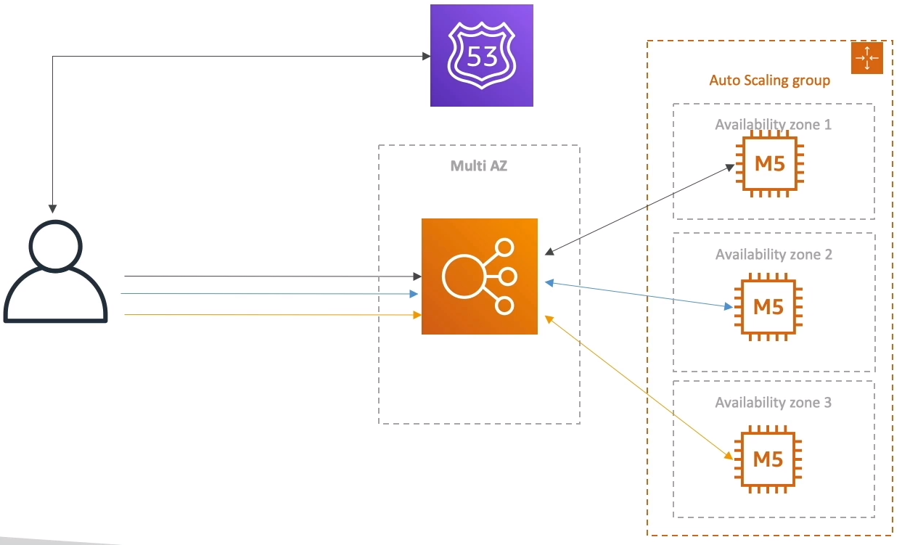
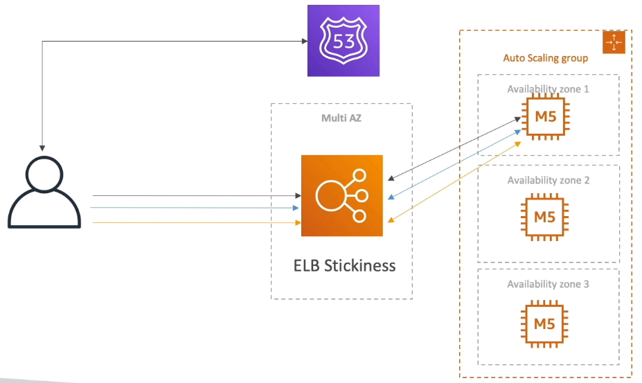
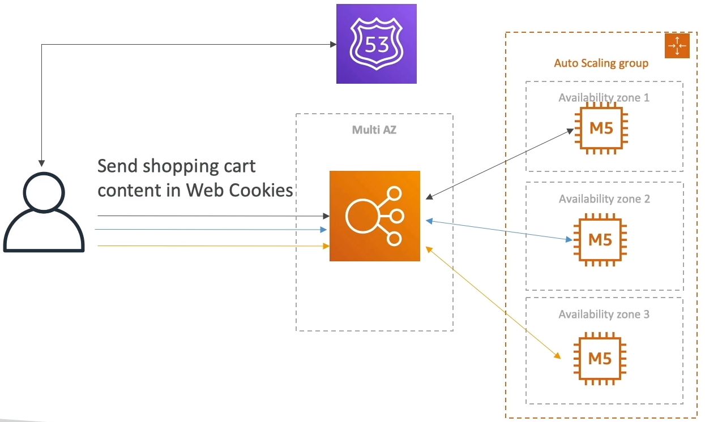
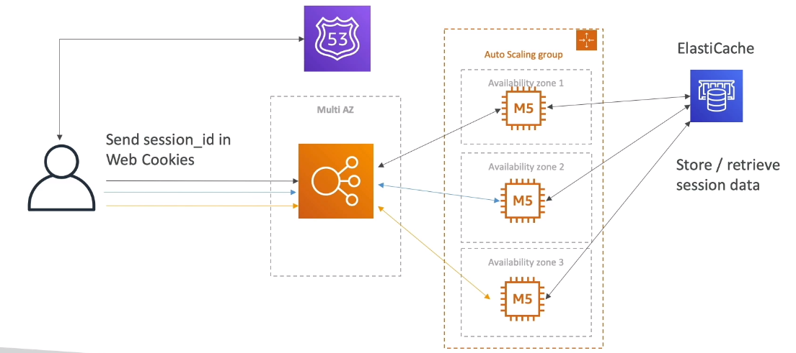
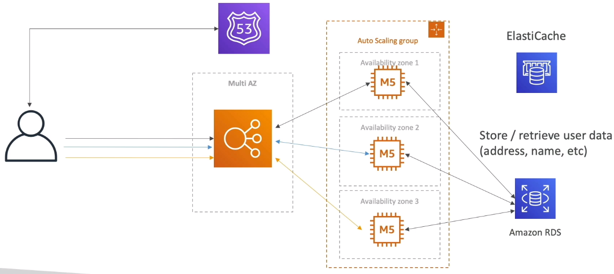
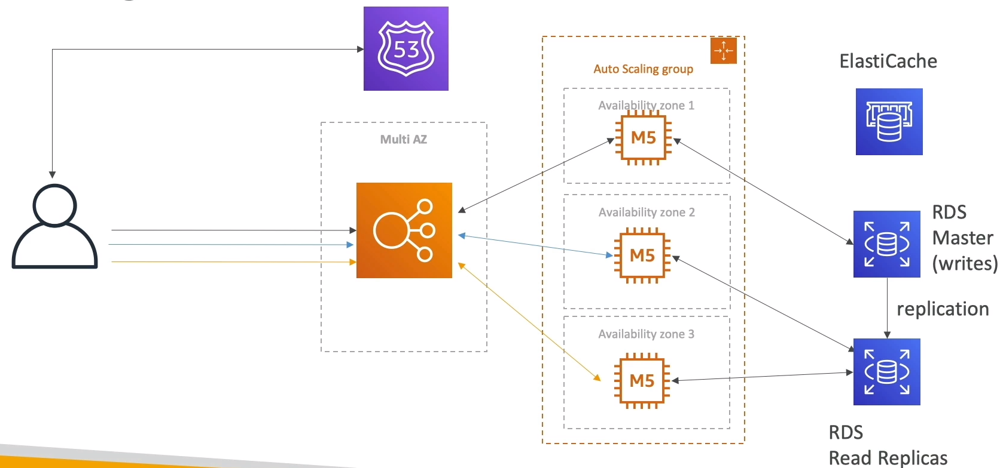
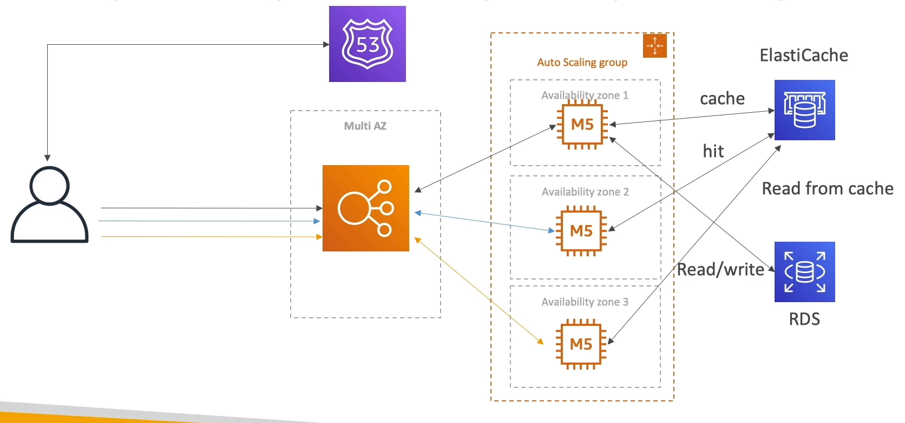
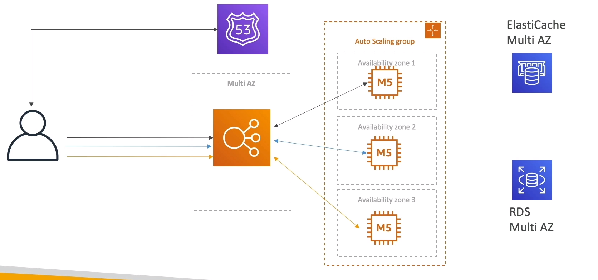
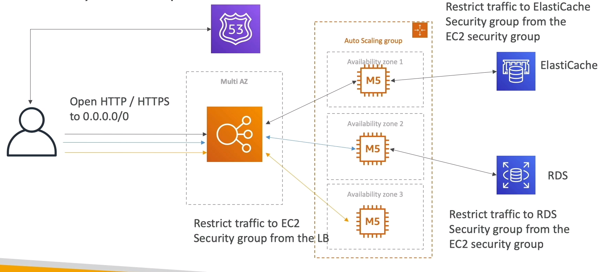

### Stateful Web App: MyClothes.com

* MyClothes.com allows people to buy clothes online.
* There's a shopping cart
* Our website is having hundreds of users at the same time.
* We need to scale, maintain horizontal scalability and keep our web application as stateless as possible.
* Users should not lose their shopping cart
* Users should have their details(address, etc) in a database

#### Stateful Web App: MyClothes.com

* Issue: In this architecture the user will lose his shopping cart, when the load balancer switches between the servers. 

#### Introduce Stickiness(Session Affinity)

* Issue: In case if an EC2 instance get terminated for some reason, then the user will lose the shopping cart, but there is definitely some improvement from the previous arch.

#### Introduce User Cookies

* Now instead of storing the user-content in EC2 instances, allow the user to store it in cookie.

* Now everytime when the user talks to a any server, each server will know what the shopping cart content is because user is the one sending the shoping cart content directly to the EC2 instances.

* Issue 1: Now the HTTP request getting heavier, because we are sending more and more data every time we add something into our shopping cart
* Issue 2: Additionally, there is some level of security risk because the cookies can be altered by attackers, and so our user may have a modified shopping cart all of a sudden.
* Cookies must be validated
* Cookies must be less than 4KB

#### Introduce Server Session

* Now instead of sending a whole shopping cart in web cookies, we're just going to send a session ID
* When the user sends the session ID, we are going to talk to an EC2 instance, and say we're going to add this thing to the cart, and so the EC2 instance will add the cart content into the ElasticCache.
* ID to retrieve the cart content is going to be the session ID

#### Storing User Data in a database

* Store the user data in amazon RDS

#### Scaling Reads

* Now there is a lots of reads happening in the website
* To scale the reads we can introduce replicas of our RDS replicas

* You can improve read using ElasticCache

#### Multi AZ - Survive disasters

* Multi AZ ALB
* Multi-AZ EC2
* Multi-AZ ElastiCache
* Multi-AZ RDS

#### Security Group

