<!-- TOC -->
  * [CIDR - IPv4](#cidr---ipv4)
    * [Understanding CIDR - IPv4](#understanding-cidr---ipv4)
    * [Understanding CIDR - Subnet Mask](#understanding-cidr---subnet-mask)
      * [Quick Memo](#quick-memo)
    * [Public vs Private IP(IPv4)](#public-vs-private-ipipv4)
  * [Default VPC Overview](#default-vpc-overview)
  * [VPC in AWS - IPv4](#vpc-in-aws---ipv4)
  * [Adding Subnet(IPv4)](#adding-subnetipv4)
  * [Internet Gateway(IGW)](#internet-gatewayigw)
  * [Bastion Hosts](#bastion-hosts)
  * [NAT Instance(outdated, but still at the exam)](#nat-instanceoutdated-but-still-at-the-exam)
    * [NAT Instance - Comments](#nat-instance---comments)
  * [NAT Gateway](#nat-gateway)
    * [NAT Gateway with High Availability](#nat-gateway-with-high-availability)
  * [NAT Gateway vs NAT Instance](#nat-gateway-vs-nat-instance)
  * [Security Groups & NACL](#security-groups--nacl)
    * [Default NACL](#default-nacl)
      * [Inbound Rules](#inbound-rules)
      * [Outbound Rules](#outbound-rules)
    * [Ephemeral Ports](#ephemeral-ports)
    * [NACL with Ephemeral Ports](#nacl-with-ephemeral-ports)
    * [Security Group vs NACLs](#security-group-vs-nacls)
  * [VPC Peering](#vpc-peering)
    * [VPC Peering - Good to know](#vpc-peering---good-to-know)
  * [VPC Endpoints(AWS PrivateLink)](#vpc-endpointsaws-privatelink)
    * [Types of Endpoints](#types-of-endpoints)
    * [Gateway or Interface Endpoint for S3?](#gateway-or-interface-endpoint-for-s3)
  * [VPC Flow Logs](#vpc-flow-logs)
    * [VPC Flow Logs Syntax](#vpc-flow-logs-syntax)
    * [VPC Flow Logs - Troubleshoot SG & NACL issues](#vpc-flow-logs---troubleshoot-sg--nacl-issues)
      * [Incoming Requests](#incoming-requests)
      * [Outgoing Requests](#outgoing-requests)
    * [VPC Flow Logs - Architectures](#vpc-flow-logs---architectures)
  * [AWS Site-to-Site VPN](#aws-site-to-site-vpn)
    * [Site-to-Site VPN Connections](#site-to-site-vpn-connections)
    * [AWS VPN CloudHub](#aws-vpn-cloudhub)
  * [Direct Connect(DX)](#direct-connectdx)
    * [Direct Connect Gateway](#direct-connect-gateway)
    * [Direct Connect - Connection Types](#direct-connect---connection-types)
    * [Direct Connect - Encryption](#direct-connect---encryption)
    * [Direct Connect - Resiliency](#direct-connect---resiliency)
  * [Site-to-Site VPN connection as a backup](#site-to-site-vpn-connection-as-a-backup)
  * [Transit Gateway](#transit-gateway)
    * [Transit Gateway: Site-to-Site VPN ECMP](#transit-gateway-site-to-site-vpn-ecmp)
    * [Transit Gateway: throughput with ECMP](#transit-gateway-throughput-with-ecmp)
    * [Transit Gateway - Share Direct Connect between multiple accounts](#transit-gateway---share-direct-connect-between-multiple-accounts)
  * [VPC - Traffic Mirroring](#vpc---traffic-mirroring)
  * [What is IPv6?](#what-is-ipv6)
    * [IPv6 in VPC](#ipv6-in-vpc)
  * [IPv6 Troubleshooting](#ipv6-troubleshooting)
  * [Egress - only Internet Gateway](#egress---only-internet-gateway)
    * [IPv6 Routing](#ipv6-routing)
  * [VPC Section Summary](#vpc-section-summary)
  * [Networking Costs in AWS per GB](#networking-costs-in-aws-per-gb-)
    * [Minimizing egress traffic network cost](#minimizing-egress-traffic-network-cost)
    * [S3 Data transfer Pricing - Analysis for USA](#s3-data-transfer-pricing---analysis-for-usa)
    * [Pricing: NAT Gateway vs Gateway VPC Endpoint](#pricing-nat-gateway-vs-gateway-vpc-endpoint)
  * [AWS Network Firewall](#aws-network-firewall)
    * [Network Firewall - Fine Grained Controls](#network-firewall---fine-grained-controls)
<!-- TOC -->

### CIDR - IPv4

* **Classless Inter-Domain Routing** - a method of allocating IP addresses
* Used in **Security Groups** rules and **AWS networking** in general
* They help in define an IP address range:
  * We've seen ww.xx.yy.zz/32 => one IP
  * We've seen 0.0.0.0/0 => all IPs

#### Understanding CIDR - IPv4

* A CIDR consists of two component
* Base IP
  * Represents an IP contained in the range(XX.XX.XX.XX)
  * Example: 10.0.0.0, 192.168.0.0,...
* Subnet Mask
  * Define how many bits can change in the IP
  * Example: /0, /24, /32
  * Can take two forms:
    * /8 <=> 255.0.0.0
    * /16 <=> 255.255.0.0
    * /24 <=> 255.255.255.0
    * /32 <=> 255.255.255.255

#### Understanding CIDR - Subnet Mask

* The Subnet Mask basically allows part of the underlying IP to get additional next values from the base IP

* 192.168.0.0/32 => allows for **1** IP (2^0)       ==> 192.168.0.0
* 192.168.0.0/31 => allows for **2** IP (2^1)       ==> 192.168.0.0 -> 192.168.0.1
* 192.168.0.0/30 => allows for **4** IP (2^2)       ==> 192.168.0.0 -> 192.168.0.3
* 192.168.0.0/29 => allows for **8** IP (2^3)       ==> 192.168.0.0 -> 192.168.0.7
* 192.168.0.0/28 => allows for **16** IP (2^4)      ==> 192.168.0.0 -> 192.168.0.15
* 192.168.0.0/27 => allows for **32** IP (2^5)      ==> 192.168.0.0 -> 192.168.0.31
* 192.168.0.0/26 => allows for **64** IP (2^6)      ==> 192.168.0.0 -> 192.168.0.63
* 192.168.0.0/25 => allows for **128** IP (2^7)     ==> 192.168.0.0 -> 192.168.0.127
* 192.168.0.0/24 => allows for **256** IP (2^8)     ==> 192.168.0.0 -> 192.168.0.255
* ...
* 192.168.0.0/16 => allows for **65,536** IP (2^16) ==> 192.168.0.0 -> 192.168.255.255
* ...
* 192.168.0.0/0  => allows for All IPs              ==> 0.0.0.0 => 255.255.255.255

##### Quick Memo
  _Octets_
__.__.__.__

* **/32** - no octet can change
* **/24** - last octet can change
* **/16** - last 2 octets can change
* **/8**  - last 3 octets can change
* **/0**  - all octets can change

#### Public vs Private IP(IPv4)

* The Internet Assigned Numbers Authority(IANA) established certain blocks of IPv4 addresses for the use of private(LAN) and public(Internet) addresses

* **Private IP** can only allow certain values:
  * 10.0.0.0 - 10.255.255.255 (10.0.0.0/8) <- in big networks
  * 172.16.0.0 - 172.31.255.255 (172.16.0.0/12) <- AWS default VPC in that range
  * 192.168.0.0 - 192.168.255.255 (192.168.0.0/16) <- e.g., home networks

* All the rest of the IP addresses on the Internet as Public

### Default VPC Overview

* All new AWS accounts have a default VPC
* New EC2 instances are launched into the default VPC if no subnet is specified
* Default VPC has Internet connectivity and all EC2 instances inside it have public IPv4 addresses.
* We also get a public and a private IPv4 DNS names

### VPC in AWS - IPv4

* VPC = Virtual Private Cloud
* You can have multiple VPCs in an AWS region(max. 5 per region - soft limit)
* Max. CIDR per VPC is 5, for each CIDR:
  * Min. size is /28 (16 IP addresses)
  * Max. size is /16 (65536 IP addresses)
* Because VPC is private, only the Private IPv4 ranges are allowed:
  * 10.0.0.0 - 10.255.255.255 (10.0.0.0/8)
  * 172.16.0.0 - 172.31.255.255 (172.16.0.0/12)
  * 192.168.0.0 - 192.168.255.255 (192.168.0.0/16)

* **Your VPC CIDR should NOT overlap with your other networks (e.g., corporate)**

### Adding Subnet(IPv4)

* AWS reserves **5 IP addresses(first 4 & last 1)** in each subnet
* These 5 IP addresses are not available for use and can't be assigned to an EC2 instance
* Example: if CIDR block 10.0.0.0/24, then reserved IP addresses are:
  * 10.0.0.0 - Network Address
  * 10.0.0.1 - reserved by AWS for the VPC routed
  * 10.0.0.2 - reserved by AWS for mapping to Amazon-provided DNS
  * 10.0.0.3 - reserved by AWS for future use
  * 10.0.0.255 - Network Broadcast Address. AWS does not support broadcast in a VPC, therefore the address is reserved.
* **Exam Tip,** if you need 29 IP addresses for EC2 instances:
  * You can't choose a subnet of size /27 (32 IP addresses, 32 - 5 = 27 < 29)
  * You need to choose a subnet of size /26 (64 IP addresses, 64 - 5 = 59 > 29)

### Internet Gateway(IGW)

* Allow resources(e.g., EC2 instances) in a VPC connect to the internet
* It scales horizontally and is highly available and redundant
* Must be created separately from a VPC
* One VPC can only be attached to one IGW and vice versa

* Internet Gateways on their own do not allow Internet access...
* Route tables must also be edited!!!

### Bastion Hosts

* We can use a Bastion Host to SSH into our private EC2 instances
* The bastion is in the public subnet which is then connected to all other private subnets
* **Bastion Host security group must allow** inbound from the internet on port 22 from restricted CIDR, for example the _public CIDR_ of your corporation
* **Security Group of the EC2 Instances** must allow the Security Group of the Bastion Host, or the _private IP_ of the Bastion Host.

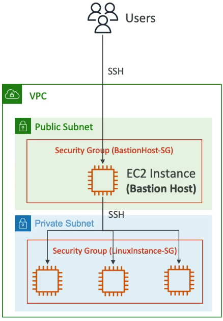

### NAT Instance(outdated, but still at the exam)

* Network Address Translation
* Allow EC2 instances in private subnets to connect to the internet
* Must be launched in a public subnet
* Must disable EC2 setting: **Source / destination check**
* Must have Elastic IP attached to it.
* Route Tables must be configured to route traffic from private subnets to the NAT Instance

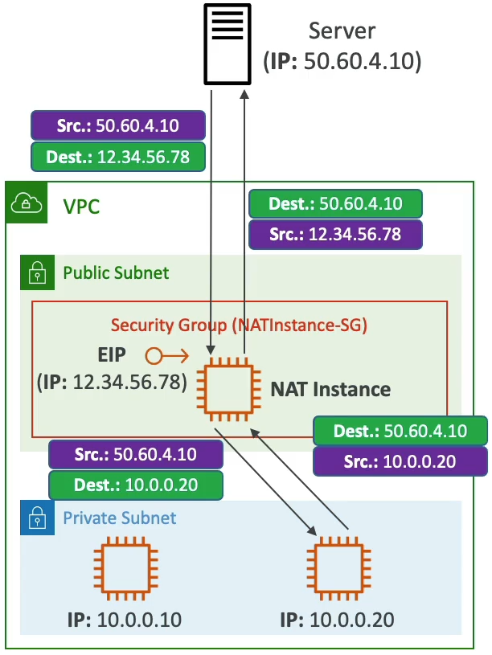

#### NAT Instance - Comments

* Pre-configured Amazon Linux AMI is available
  * Reached the end of standard support on December 31, 2020
* Not highly available / resilient setup out of the box
  * You need to create an ASG in multi-AZ + resilient user-data script
* Internet traffic bandwidth depends on EC2 instance type
* You must manage Security Group & rules
  * Inbound:
    * Allow HTTP / HTTPS traffic coming from Private Subnets
    * Allow SSH from your home network(access is provided through Internet Gateway)
  * Outbound:
    * Allow HTTP / HTTPS traffic to the Internet

### NAT Gateway

* AWS-managed NAT, higher bandwidth, high availability, no administration
* Pay per hour of usage and bandwidth
* NATGW is created in a specific AZ, uses an Elastic IP
* Can't be used by EC2 instance in the same subnet(only from other subnets)
* Requires an IGW(Private Subnet => NATGW => IGW)
* 5 Gbps of bandwidth with automatic scaling up to 100 Gbps
* No Security Group to manage / required

#### NAT Gateway with High Availability

* NAT Gateway is resilient within a single Availability Zone.
* Must create multiple **NAT Gateways** in **multiple AZs** for fault-tolerance
* There is no cross-AZ failover needed because if an AZ goes down it doesn't need NAT

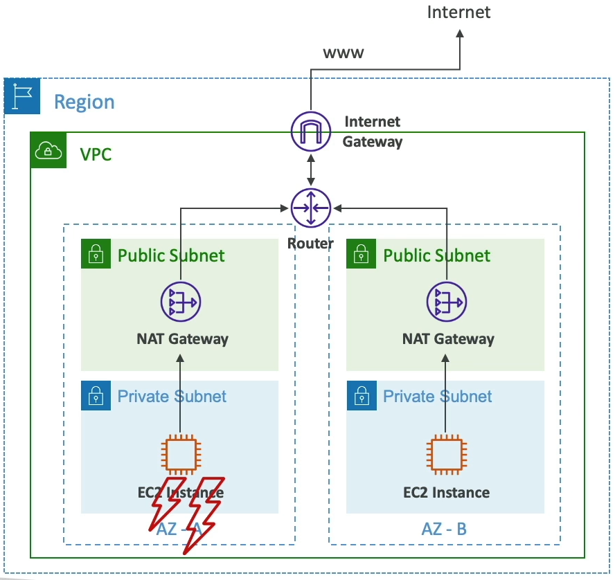

### NAT Gateway vs NAT Instance

|                     | NAT Gateway                                    | NAT Instance                                      |
|---------------------|------------------------------------------------|---------------------------------------------------|
| Availability        | Highly available with AZ(create in another AZ) | Use a script to manage failover between instances |
| Bandwidth           | Upto 100 Gbps                                  | Depends on EC2 instance type                      |
| Maintenance         | Managed by AWS                                 | Managed by you(e.g., software, OS patches)        |
| Cost                | Per hour & amount of data transferred          | Per hour, EC2 instance type and size, + network $ |
| Public IPv4         | Yes                                            | Yes                                               |
| Private IPv4        | Yes                                            | Yes                                               |
| Security Groups     | No                                             | Yes                                               |
| Use as Bastion Host | No                                             | Yes                                               |

### Security Groups & NACL

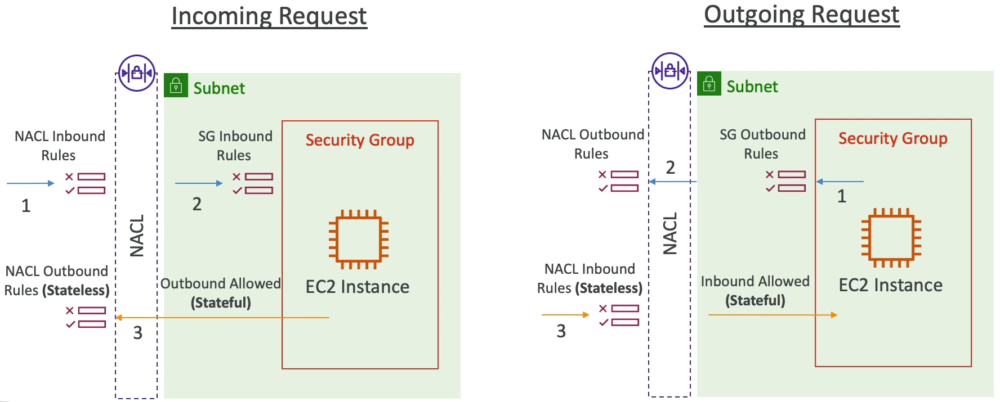

* NACL are like a firewall which control traffic from and to **subnets**
* **One NACL per subnet,** new subnets are assigned the **Default NACL**
* You define **NACL Rules**:
  * Rules have a number(1-32766), higher precedence with a lower number
  * First rule match will drive the decision
  * Example: if you define #100 ALLOW 10.0.0.10/32 and #200 DENY 10.0.0.10/32, the IP address will be allowed because 100 has a higher precedence over 200
  * The last rule is an asterisk (*) and denies a request in case of no rule match.
  * AWS recommends adding rules by increment of 100
* Newly created NACLs will deny everything
* NACL are a great way of blocking a specific IP address at the subnet level

#### Default NACL

* Accepts everything inbound/outbound with the subnets it's associated with
* Do NOT modify the Default NACL, instead create custom NACLs

##### Inbound Rules

| Rule# | Type             | Protocol | Port Range | Source    | Allow/Deny |
|-------|------------------|----------|------------|-----------|------------|
| 100   | All IPv4 Traffic | All      | All        | 0.0.0.0/0 | ALLOW      |
| *     | All IPv4 Traffic | All      | All        | 0.0.0.0/0 | DENY       |

##### Outbound Rules

| Rule# | Type             | Protocol | Port Range | Destination | Allow/Deny |
|-------|------------------|----------|------------|-------------|------------|
| 100   | All IPv4 Traffic | All      | All        | 0.0.0.0/0   | ALLOW      |
| *     | All IPv4 Traffic | All      | All        | 0.0.0.0/0   | DENY       |

#### Ephemeral Ports

* For any two endpoints to establish a connection, they must use ports
* Clients connect to a **defined port,** and expect a response on an **ephemeral port**
* Different Operating Systems use different port ranges, examples:
  * IANA & MS Windows 10 => 49152 - 65535
  * Many Linux Kernels => 32768 - 60999

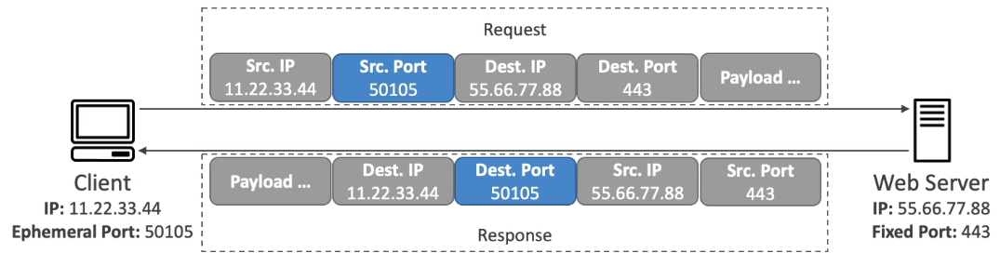

#### NACL with Ephemeral Ports

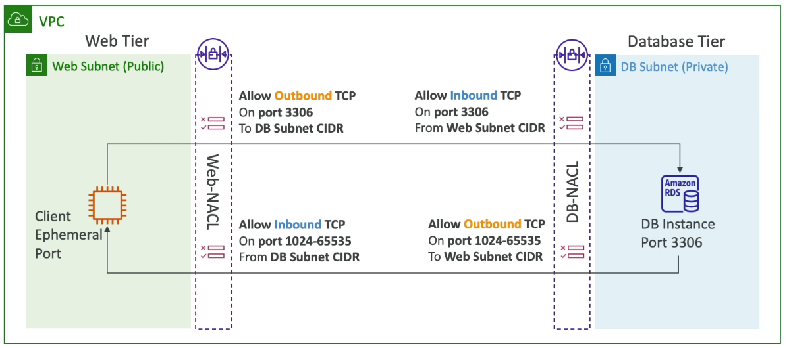

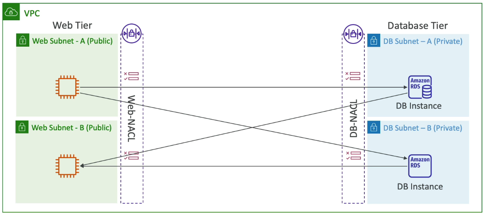

#### Security Group vs NACLs

| Security Group                                                             | NACL                                                                                                     |
|----------------------------------------------------------------------------|----------------------------------------------------------------------------------------------------------|
| Operates at the instance level                                             | Operates at the subnet level                                                                             |
| Supports allow rules only                                                  | Support allow rules and deny rules                                                                       |
| Stateful: return traffic is automatically allowed, regardless of any rules | Stateless: return traffics must be explicitly allowed by rules                                           |
| All rules are evaluated before deciding whether to allow traffic           | Rules are evaluated in order(lowest to highest) when deciding whether to allow traffic, first match wins |
| Applies to an EC2 instance when specified by someone                       | Automatically applies to all EC2 instances in the subnet that it's associated with                       |

### VPC Peering

* Privately connect two VPCs using AWS network
* Make them behave as if they were in the same network
* Must not have overlapping CIDRs
* VPC Peering connection is **NOT transitive** (must be established for each VPC that need to communicate with one another)
* You must update route tables in each VPC's subnet to ensure EC2 instances can communicate with each other

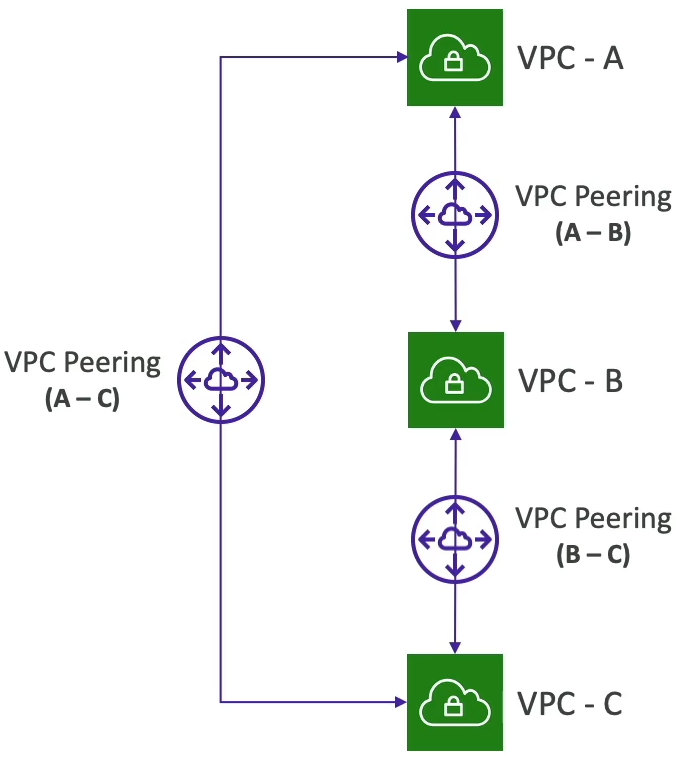

#### VPC Peering - Good to know

* You can create VPC Peering connection between VPCs in **different AWS accounts/regions**
* You can reference a security group in a peered VPC(works cross account - same region)

### VPC Endpoints(AWS PrivateLink)

* Every AWS service is publicly exposed (public URL)
* VPC Endpoints(powered by AWS PrivateLink) allows you to connect to AWS services using a **private network** instead of using the public network
* They're redundant and scale horizontally
* They remove the need of IGW, NATGW,... to access AWS services
* In case of issues:
  * Check DNS Setting Resolution in your VPC
  * Check Route Tables

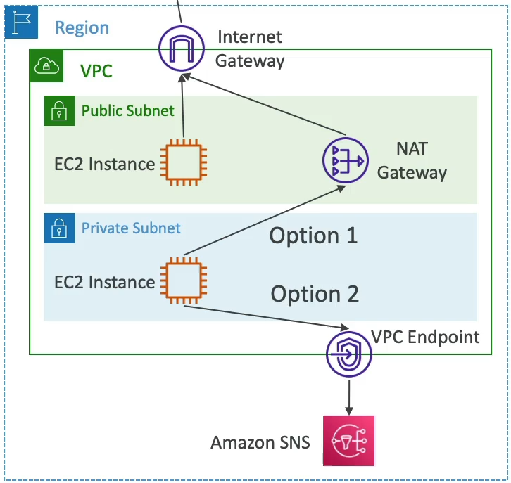

#### Types of Endpoints

* _Interface Endpoints(powered by PrivateLink)_
  * Provisions an ENI(private IP address) as an entry point(must attach a Security Group)
  * Supports most AWS services because there is an ENI
  * $ per hour + $ per GB of data processed
  
* _Gateway Endpoints_
  * Provisions a gateway and must be used **as a target in a route table(does not use security groups)**
  * Supports both **S3** and **DynamoDB**
  * Free

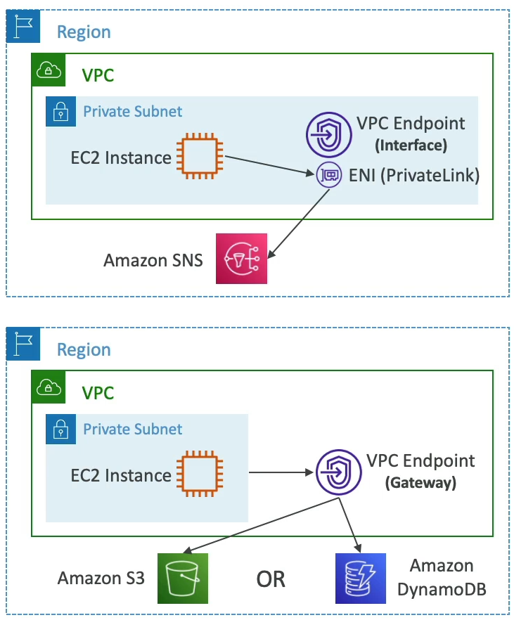

#### Gateway or Interface Endpoint for S3?

* **Gateway is most likely going to be preferred all the time at the exam**
* Cost: free for Gateway, $ for interface endpoint
* Interface Endpoint is preferred access is required from on-premises(Site to Site VPN or Direct Connect), a different VPC or a different region

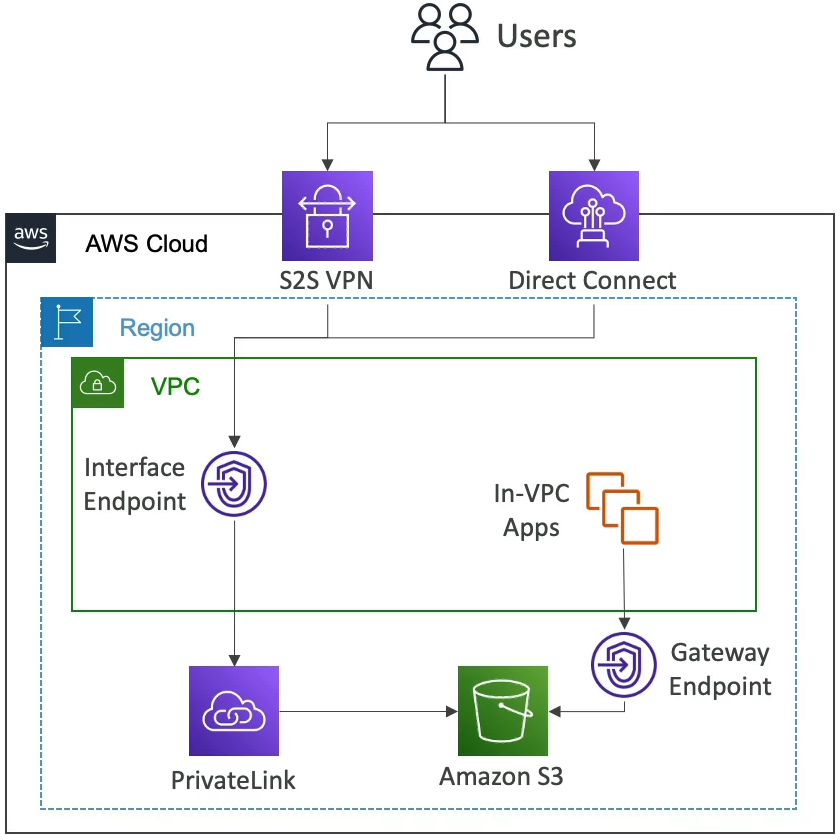

### VPC Flow Logs

* Capture information about IP traffic going into your interfaces:
  * VPC Flow Logs
  * Subnet Flow Logs
  * Elastic Network Interface(ENI) Flow Logs
* Helps to monitor & troubleshoot connectivity issues
* Flow logs data can go to S3, CloudWatch Logs, and Kinesis Data Firehose
* Capture network information from AWS managed interface too: ELB, RDS, ElastiCache, RedShift, WorkSpaces, NATGW, Transit Gateway

#### VPC Flow Logs Syntax

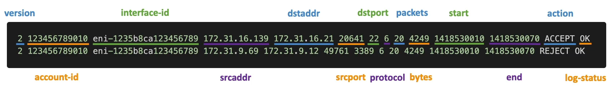

* **srcaddr & dstaddr** - help identify problematic IP
* **srcport & dstport** - help identify problematic ports
* Action - success or failure of the request due to Security Group / NACL
* Can be used for analytics on usage patterns, or malicious behavior
* **Query VPC flow logs using Athena on S3 or CloudWatch Logs Insights**

#### VPC Flow Logs - Troubleshoot SG & NACL issues

##### Incoming Requests

* Inbound REJECT => NACL or SG
* Inbound ACCEPT, Outbound REJECT => NACL

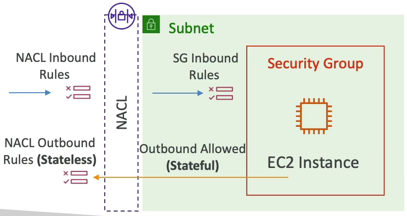

##### Outgoing Requests

* Outbound REJECT => NACL or SG
* Outbound ACCEPT, Inbound REJECT => NACL

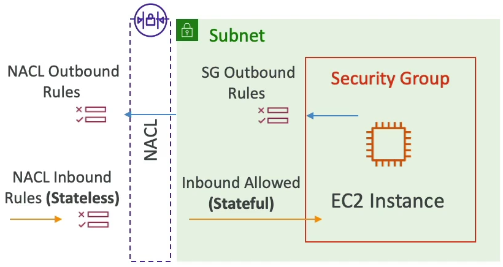

#### VPC Flow Logs - Architectures

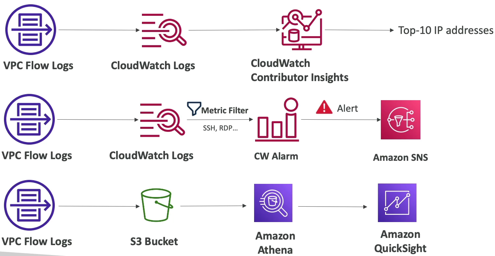

### AWS Site-to-Site VPN

* **Virtual Private Gateway**
  * VPN concentrator on the AWS side of the VPN connection
  * VGW is created and attached to the VPC from which you want to create the Site-to-Site connection
  * Possibility to customize the **ASN(Autonomous System Number)**
* **Customer Gateway**
  * Software application or physical device on customer side of the VPN connection

####  Site-to-Site VPN Connections

* **Customer Gateway Device(On-premises)**
  * **What IP address to use?**
    * Public Internet-routable IP address for your Customer Gateway device
    * If it's behind a NAT device that's enabled for NAT traversal(NAT-T), use the public IP address of the NAT device
* **Important step**: enable **Route Propagation** for the Virtual Private Gateway in the route table that is associated with your subnets
* If you need to ping your EC2 instances from on-premises, make sure you add the ICMP protocol on the inbound of your security group.

#### AWS VPN CloudHub

* **Provide secure communication between multiple sites**, if you have multiple VPN connections
* Low-cost **hub-and-spoke model for primary or secondary network connectivity between different locations**(VPN only)
* It's a VPN connection, so it goes over the **public internet**.
* To set it up, connection multiple VPN connections on the same VGW, setup dynamic routing and configure route tables.

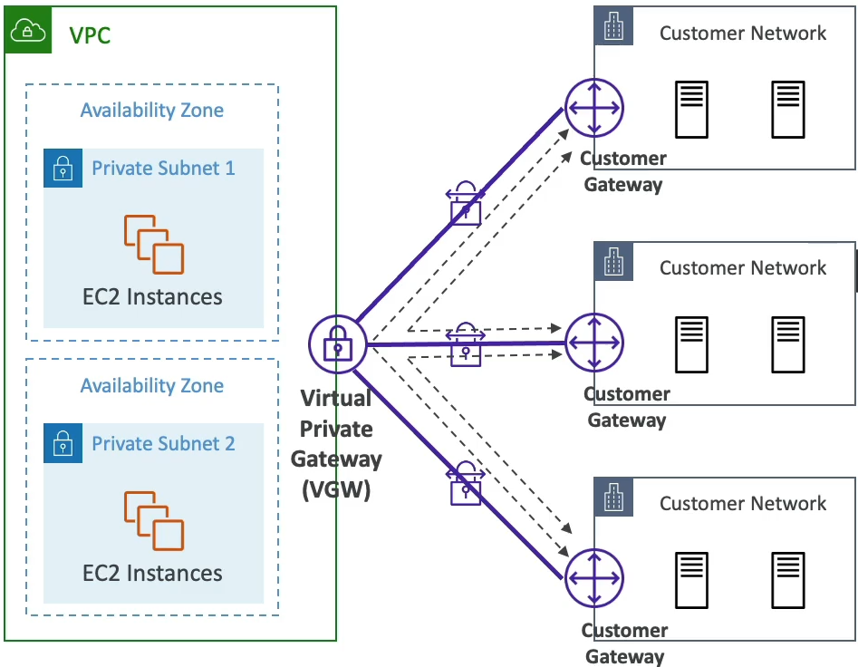

### Direct Connect(DX)

* Provides a dedicate private connection from a remote network to your VPC
* Dedicated connection must be setup between your DC and AWS Direct Connect locations
* You need to set up a Virtual Private Gateway on your VPC
* Access public resources(S3) and private (EC2) on same connection
* Use cases:
  * Increase bandwidth throughput - working with large data sets - lower cost
  * More consistent network experience - applications using real-time data feeds
  * Hybrid Environments(on prem + cloud)
* Supports both IPv4 and IPv6

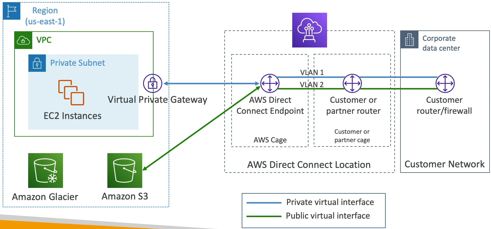

#### Direct Connect Gateway

* If you want to setup a Direct Connect to one or more VPC in many different region(same account), you must use a Direct Connect Gateway

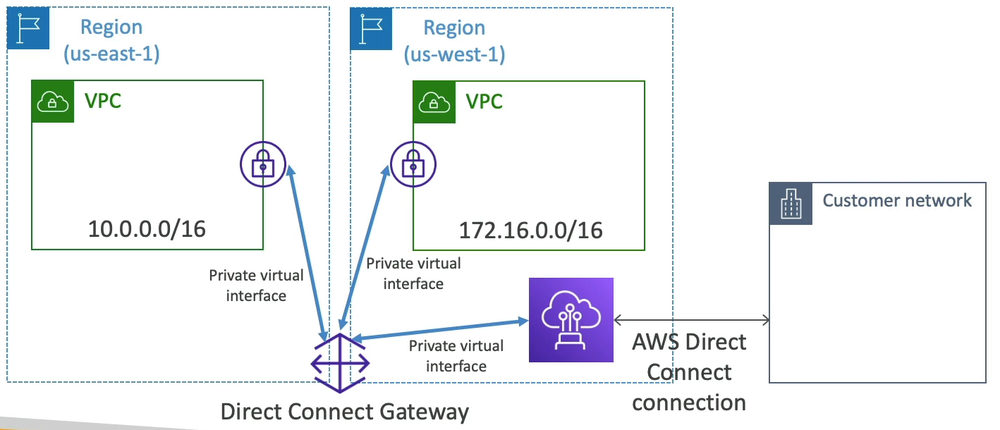

#### Direct Connect - Connection Types

* **Dedicated Connections:** 1 Gbps, 10 Gbps, and 100 Gbps capacity
  * Physical ethernet port dedicate to a customer
  * Request made to AWS first, then completed by AWS Direct Connect Partners
* **Hosted Connections:** 50 Mbps, 500 Mbps, to 10 Gbps
  * Connection requests are made via AWS Direct Connect Partners
  * Capacity can be added or removed on demand
  * 1, 2, 5, 10 Gbps available at select AWS Direct Connect Partners
* Lead times are often longer then 1 month to establish a new connection

#### Direct Connect - Encryption

* Data in transit is **not encrypted** but is private
* AWS Direct Connect + VPN provides an IPsec - encrypted private connection
* Good for an extra level of security, but slightly more complex to put in place

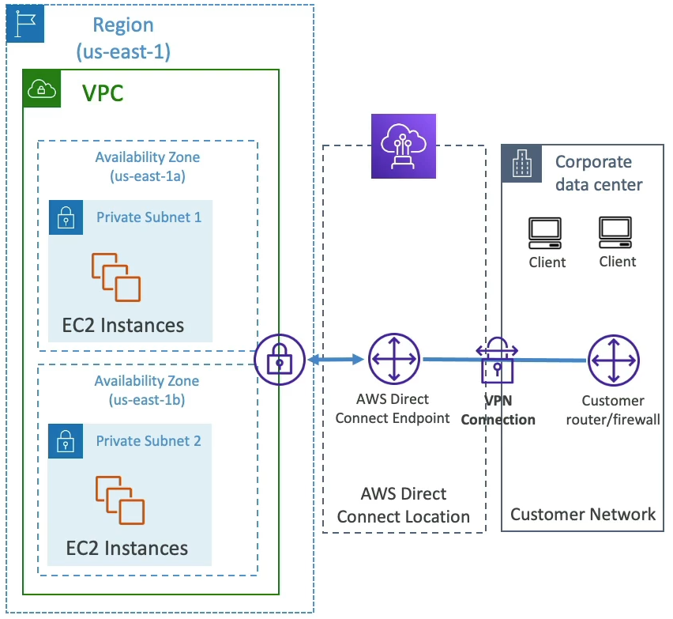

#### Direct Connect - Resiliency

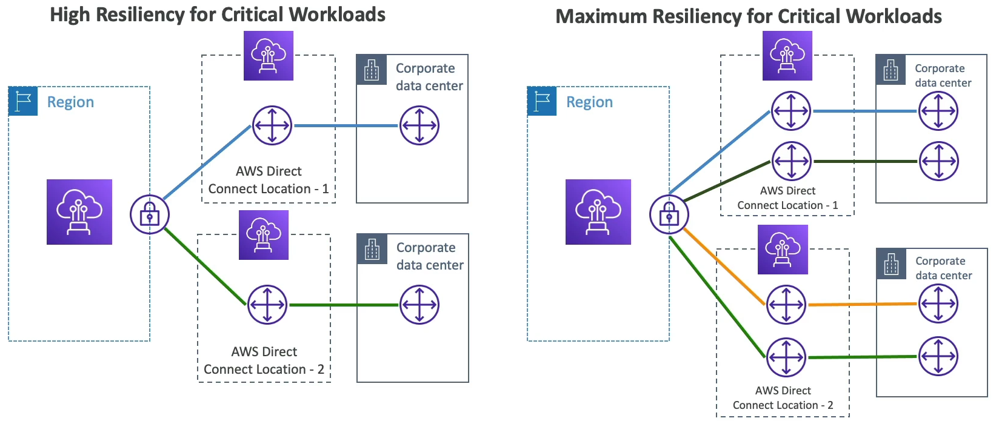

* **Maximum resilience is achieved by separate connections terminating on separate devices in more than one location.**

### Site-to-Site VPN connection as a backup

* In case Direct Connect fails, you can set up a backup Direct Connect connection(expensive), or a Site-to-Site connection

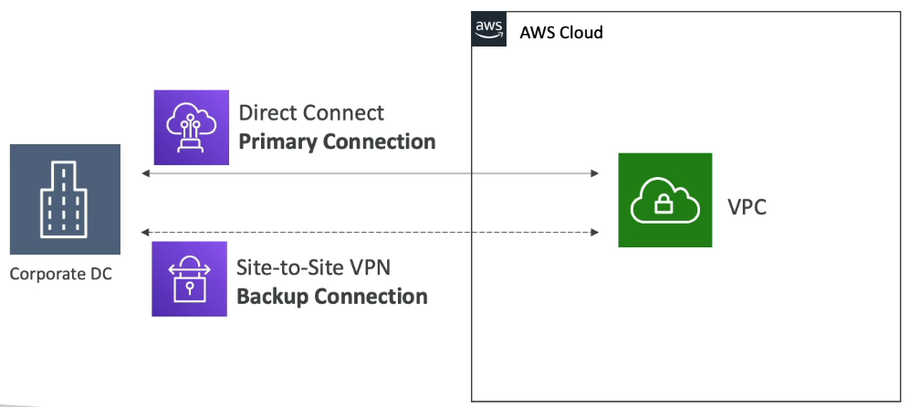

### Transit Gateway

* For having transitive peering between thousands of VPC and on-premises, hub-and-spoke(star) connection
* Regional resource, can work cross-region
* Share cross-account using Resource Access Manager(RAM)
* You can peer Transit Gateways across regions
* **Route Tables: limit which VPC can talk with other VPC**
* Works with **Direct Connect Gateway, VPN connections**
* Supports **IP Multicast**(not supported by any other AWS service)

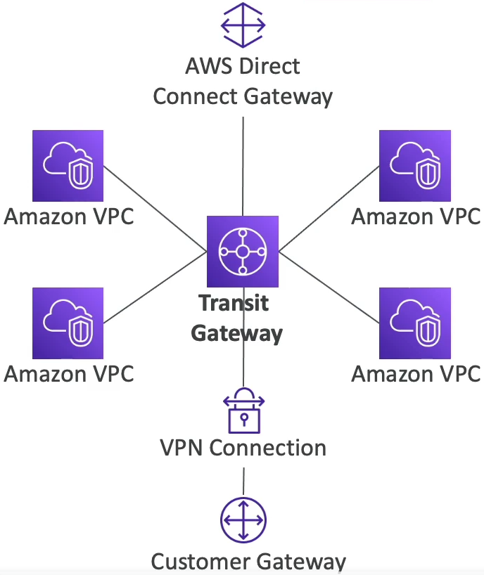

#### Transit Gateway: Site-to-Site VPN ECMP

* ECMP - Equal cost multi-path routing
* Routing strategy to allow to forward a packet over multiple best path
* Use case: create multiple Site-to-Site VPN connections **to increase the bandwidth of your connection to AWS**

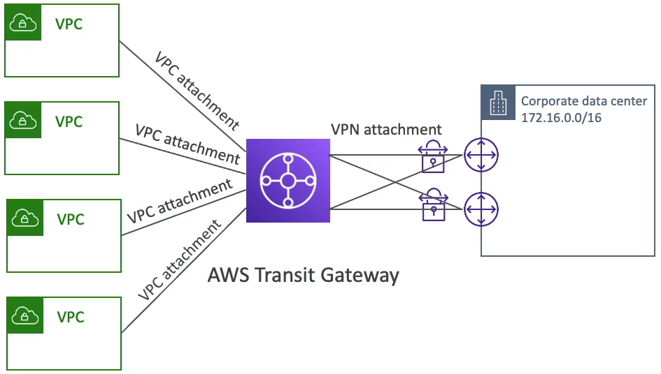

#### Transit Gateway: throughput with ECMP

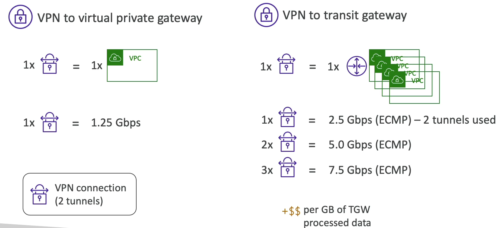

#### Transit Gateway - Share Direct Connect between multiple accounts

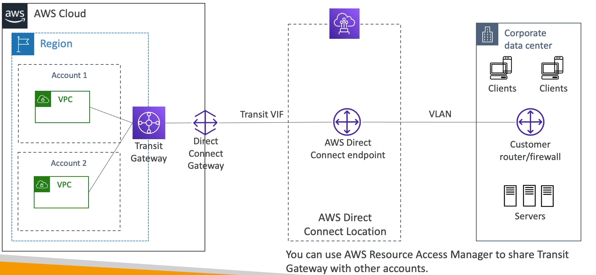

### VPC - Traffic Mirroring

* Allows you to capture and inspect network traffic in your VPC
* Route the traffic to security appliances that you manage
* Capture the traffic
  * **From(Source)** - ENIs
  * **To(Target)** - an ENI or a Network Load Balancer
* Capture all packets or capture the packets of your interest(optionally, truncate packets)
* Source and target can be in the same VPC or different VPCs(VPC Peering)
* Use cases: content inspection, threat monitoring, troubleshooting,...

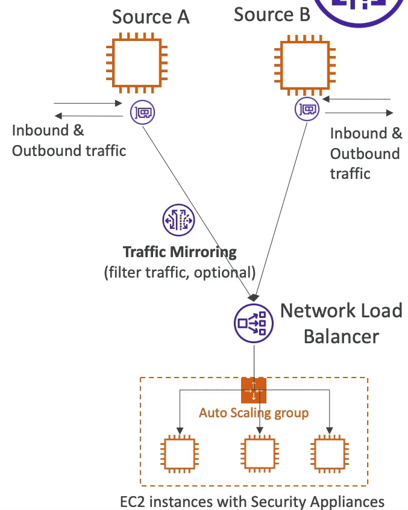

### What is IPv6?

* IPv6 is  the successor of IPv4
* IPv6 is designed to provide 3.4 * 10^38 unique IP addresses
* Every IPv6 address in AWS is public and Internet-routable(no private range)
* Format => x.x.x.x.x.x.x.x (x is hexadecimal, range can be from 0000 to ffff)
* Examples: 
  * 2001:db8:3333:4444:5555:6666:7777:8888
  * 2001:db8:3333:4444:cccc:dddd:eeee:ffff
  * :: => all segments are zero
  * 2001:db8:: => the last 6 segments are zero
  * ::1234:5678 => the first 6 segments are zero
  * 2001:db8::7777:8888 => the middle 4 segments are zero

#### IPv6 in VPC

* IPv4 cannot be disabled for your VPC and subnets
* You can enable IPv6(they're public IP addresses) to operate in dual stack mode
* Your EC2 instances will get at atleast a private internal IPv4 and a public IPv6
* They can communicate using either IPv4 or IPv6 to the internet through an Internet Gateway 

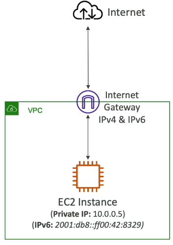

### IPv6 Troubleshooting

* **IPv4 cannot be disabled for your VPC and subnets**
* So, if you cannot launch an EC2 instance in your subnet
  * It's not because it cannot acquire an IPv6(the space is very large)
  * It's because there are not available IPv4 in your subnet
* _Solution_: create a new IPv4 CIDR in your subnet

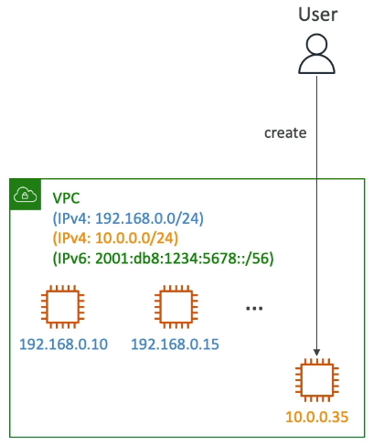

### Egress - only Internet Gateway

* Used for IPv6 only
* (similar to a NAT Gateway but for IPv6)

* Allow instances in your VPC outbound connections over IPv6 while preventing the internet to initiate an IPv6 connection to your instances
* **You must update the Route Tables**

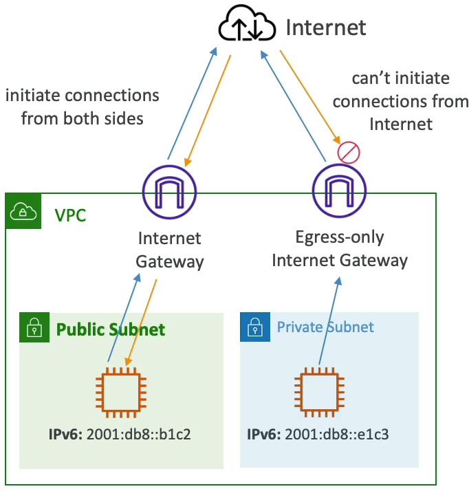

#### IPv6 Routing

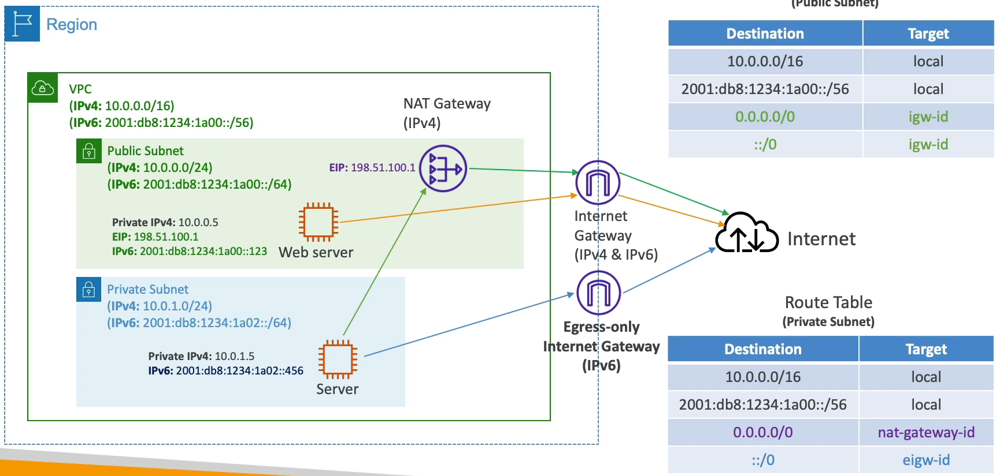

### VPC Section Summary

* **CIDR** - IP Range
* **VPC** - Virtual Private Cloud => we define a list of IPv4 & IPv6 CIDR
* **Subnets** - tied to an AZ, we define a CIDR
* **Internet Gateway** - at the VPC level, provide IPv4 & IPv6 Internet Access
* **Route Tables** - must be edited to add routes from subnet to the IGW, IPC Peering Connections, VPC Endpoints,...
* **Bastion Host** - public EC2 instance to SSH into, that has SSH connectivity to EC2 instances in private subnets
* **NAT Instances** - gives Internet access to EC2 instances in private subnets. Old, must be setup in a public subnet, disable Source / Destination check flag
* **NAT Gateway** - managed by AWS, provides scalable Internet access to private EC2 instances, when the target is an IPv4 address.
* **NACL** - stateless, subnet rules for inbound and outbound, don't forget Ephemeral Ports
* **Security Groups** - stateful, operate at the EC2 instance level
* **VPC Peering** - connect two VPCs with no overlapping CIDR, non-transitive
* **VPC Endpoints** - provide private access to AWS Service(S3, DynamoDB, CloudFormation, SSM) within a VPC
* **VPC Flow Logs** - can be setup at the VPC / Subnet / ENI Level, for ACCEPT and REJECT traffic, helps to identify attacks, analyze using Athena or CloudWatch Logs Insights
* **Site-to-Site VPN** - set up a Customer Gateway on DC, a Virtual Private Gateway on VPC, and site-to-site VPN over public Internet
* **AWS VPN CloudHub** - **hub-and-spoke** VPN model to connect your sites
* **Direct Connect** - setup a Virtual Private Gateway on VPC, and establish a direct private connection to an AWS Direct Connect Location
* **Direct Connect Gateway** - setup a Direct Connect to many VPCs in different AWS regions
* **AWS PrivateLink / VPC Endpoint Services:**
  * Connect services privately from your **service VPC to customer VPC**
  * Doesn't need VPC Peering, public Internet, NAT Gateway, Route Tables
  * Must be used with Network Load Balancer & ENI
* **ClassicLink** - connect EC2 - Classic EC2 instances privately to your VPC
* **Transit Gateway** - transitive peering connections for VPC, VPN, & DX
* **Traffic Mirroring** - copy network traffice from ENUs for further analysis
* **Egrees-only Internet Gateway** - like a NAT Gateway, but for IPv6

### Networking Costs in AWS per GB 

* Use Private IP instead of Public IP for good savings and better network performance
* Use same AZ for maximum savings (at the cost of high availability)

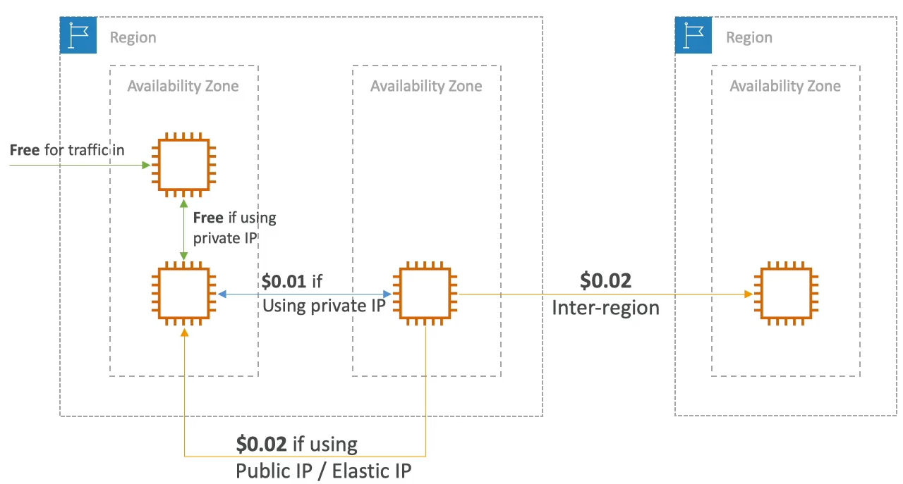

#### Minimizing egress traffic network cost

* Egress traffic: outbound traffic(from AWS to outside)
* Ingress traffic: inbound traffic - from outside to AWS(typically free)
* **Try to keep as much internet traffic within AWS to minimize costs.**
* **Direct Connect location that are co-located in the same AWS Region result in lower cost for egress network.**

#### S3 Data transfer Pricing - Analysis for USA

* **S3 ingress**: free
* **S3 to Interest**: $0.09 per GB
* **S3 Transfer Acceleration**:
  * Faster transfer times(50 to 500% better)
  * Additional cost on top of Data Transfer Pricing: +$0.04 to $0.08 per GB
* **S3 to CloudFront**: $0.00 per GB
* **CloudFront to Internet**: $0.085 per GB(slightly cheaper than S3)
  * Caching capability(lower latency)
  * Reduce costs associated with S3 Requests Pricing(7* Cheaper with CloudFront)
* **S3 Cross Region Replication:** $0.02 per GB

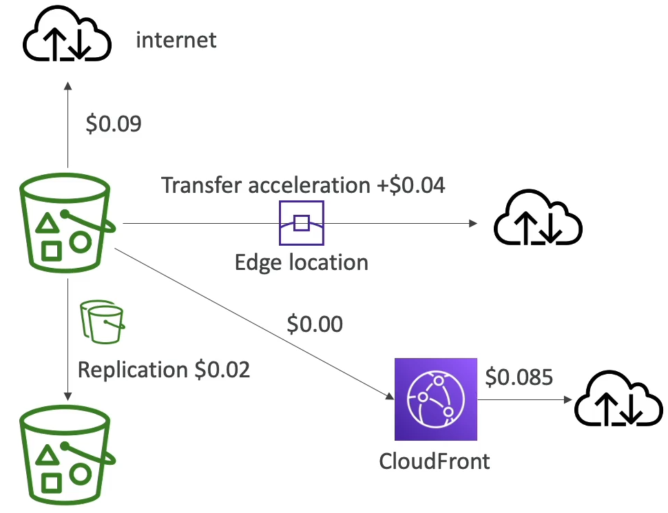

#### Pricing: NAT Gateway vs Gateway VPC Endpoint

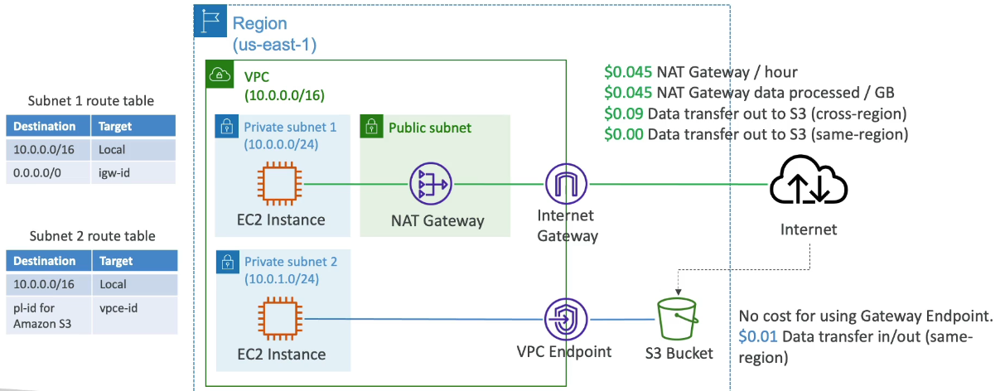

### AWS Network Firewall

* To protect network on AWS, we've seen
  * Network Access Control Lists(NACLs)
  * Amazon VPC security groups
  * AWS WAF(protect against malicious requests)
  * AWS Shield & AWS Shield Advanced
  * AWS Firewall Manager(to manage them across accounts)
  
* But what if you want to protect in a sophisticated way our entire VPC?

* Protect your entire Amazon VPC
* From Layer 3 to Layer 7 protection
* Any direction, you can inspect
  * VPC to VPC traffic
  * Outbound to internet
  * Inbound from internet
  * To / from Direct Connect & Site-to-Site VPN
* Internally, the AWS Network Firewall uses the **AWS Gateway Load Balancer**
* Rules can be centrally managed cross-account by AWS Firewall Manager to apply to many VPCs

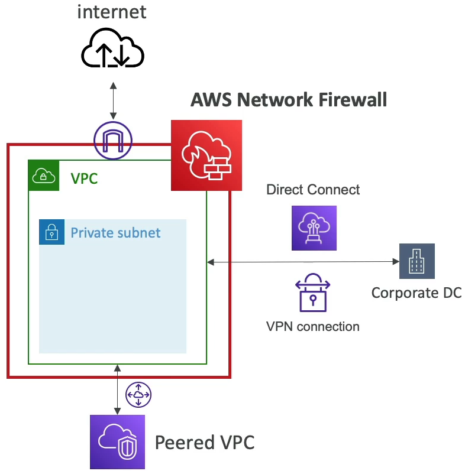

#### Network Firewall - Fine Grained Controls

* Supports 1000s of rules
* **Traffic filtering: Allow, drop or alert for the traffic that matches the rules**
* **Active Flow inspection** to protect against network threats with intrusion-prevention capabilities(like Gateway Load Balancer, but all managed by AWS)
* Send logs of rule matches to Amazon S3, CloudWatch Logs, Kinesis Data Firehose