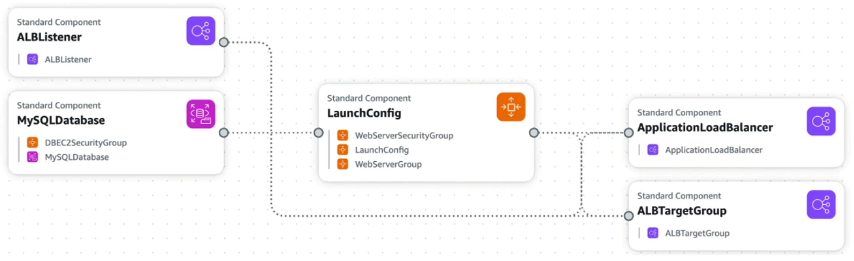
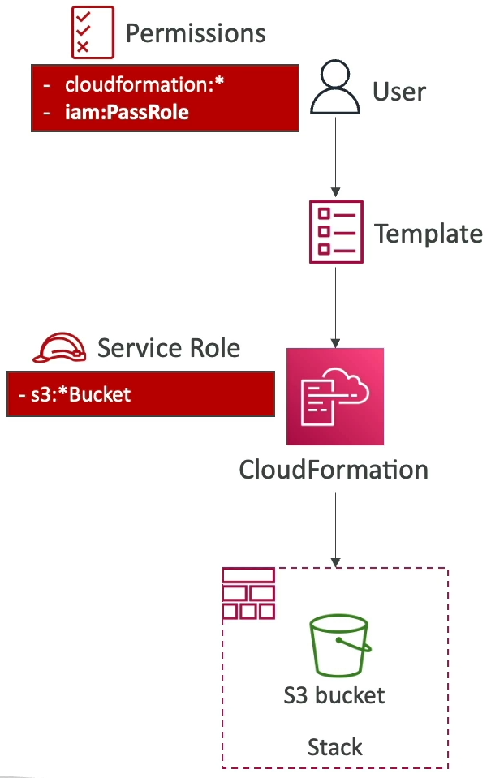
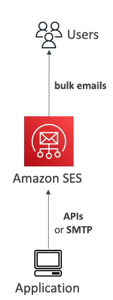
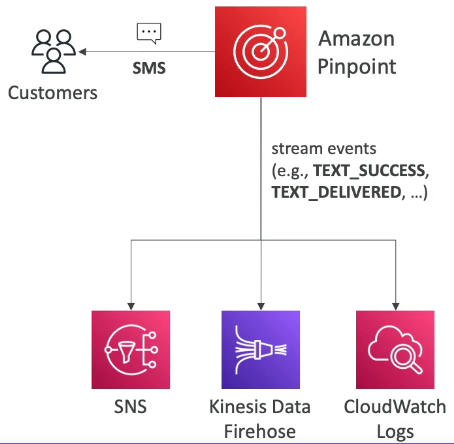
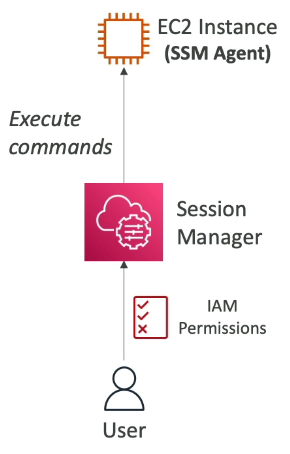
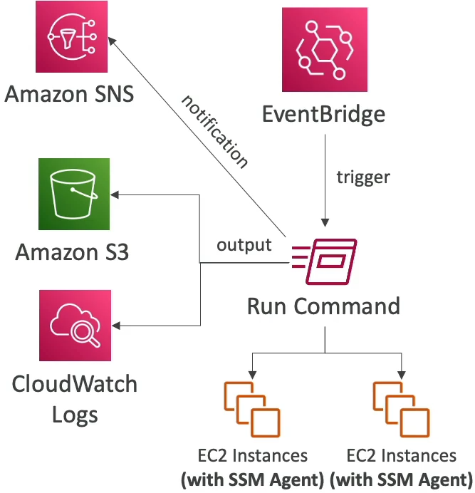
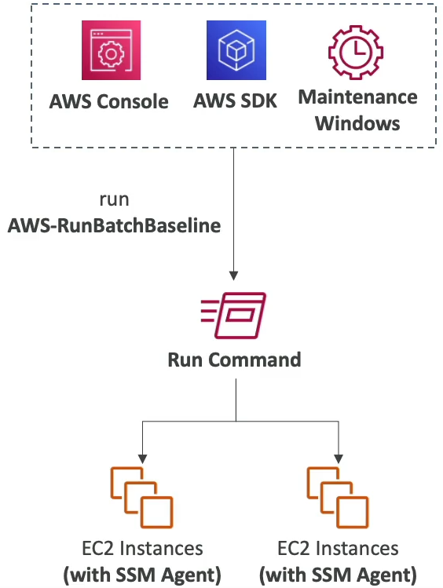
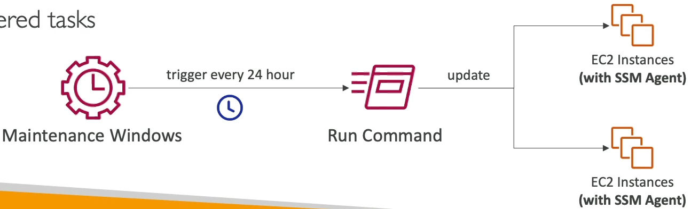
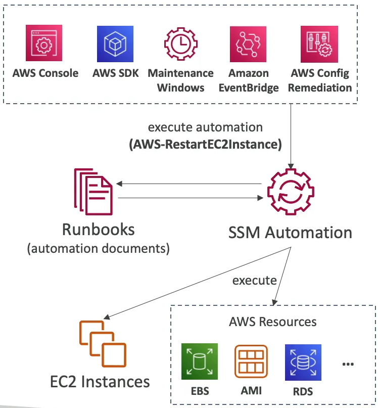
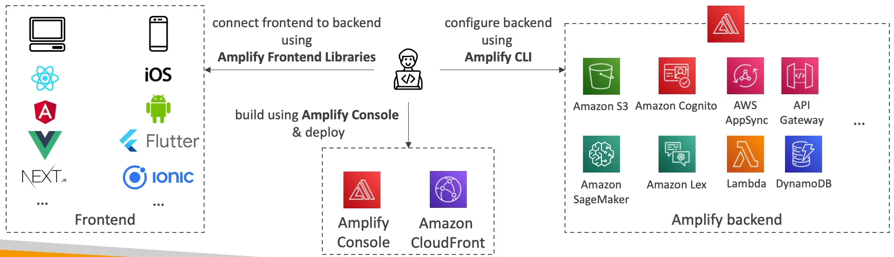

<!-- TOC -->
  * [What is CloudFormation](#what-is-cloudformation)
    * [Benefits of AWS CloudFormation](#benefits-of-aws-cloudformation)
    * [CloudFormation + Application Composer](#cloudformation--application-composer)
  * [CloudFormation - Service Role](#cloudformation---service-role)
  * [Amazon Simple Email Service (Amazon SES)](#amazon-simple-email-service-amazon-ses)
  * [Amazon Pinpoint](#amazon-pinpoint)
  * [System Manager - SSM Session Manager](#system-manager---ssm-session-manager)
    * [Systems Manager - Run Command](#systems-manager---run-command)
    * [System Manager - Patch Manager](#system-manager---patch-manager)
    * [System Manager - Maintenance Windows](#system-manager---maintenance-windows)
    * [System Manager - Automation](#system-manager---automation-)
  * [AWS Batch](#aws-batch-)
  * [AWS Amplify - web and mobile applications](#aws-amplify---web-and-mobile-applications)
<!-- TOC -->

### What is CloudFormation

* CloudFormation is a declarative way of outlining your AWS Infra, for any resources(most of them are supported)
* For example within a CloudFormation template, you say:
  * I want a security Group
  * I was two EC2 instances using this security group
  * I want an S3 bucket
  * I want a load balancer(ELB) in front of these machines
* Then CloudFormation creates those for you, in the **right order**, with the **exact configuration** that you specify

#### Benefits of AWS CloudFormation

* Infrastructure as code
  * No resources are manually created, which is excellent for control
  * Changes to the infrastructure are reviewed through code
  
* Cost
  * Each resource within the stack is tagged with an identifier so you easily see how much a stack costs you
  * You can estimate the cost of your resources using the CloudFormation template
  * Saving strategy: In Dev you could automate deletion of templates at 5 PM and recreated at 8 AM safely
  
* Productivity
  * Ability to destroy and re-create an infrastructure on the cloud on the fly
  * Automated generation of Diagram for your templates
  * Declarative programming(no need to figure out ordering and orchestration)
  
* Don't re-invent the wheel
  * Leverage existing templates on the web
  * Leverage the documentation
  
* Supports all AWS resources
  * You can use "custom resources" for resources that are not supported

#### CloudFormation + Application Composer

* We can see all the resources
* We can see the relations between the components

### CloudFormation - Service Role

* IAM role that allows CloudFormation to create/update/delete stack resources on your behalf.
* Give ability to users to create/update/delete the stack resources even if they don't have permissions to work with the resources in the stack
* Use cases:
  * You want to achieve the least privilege principle
  * But you don't want to give the user all the required permissions to create the stack resources
* User must have **iam:PassRole** permissions

### Amazon Simple Email Service (Amazon SES)

* Fully managed service to send emails securely, globally and at scale
* Allows inbound/outbound emails
* Reputation dashboard, performance insights, anti-spam feedback
* Provides statistics such as email deliveries, bounces, feedback loop results, email open
* Supports DomainKeys Identified Mail(DKIM) and Sender Policy Framework(SPF)
* Flexible IP deployment: shared, dedicated and customer-owned IPs
* Send emails using you application using AWS Console, APIs, or SMT

* **Use cases**: transactional, marketing and bulk email communications

### Amazon Pinpoint

* Scalable **2-way(outbound/inbound)** marketing communications service
* Supports email, SMS, push, voice, and in-app messaging
* Ability to segment and personalize messages with the right content to customers
* Possibility to receive replies
* Scales to billions of messages per day
* Use cases: run campaigns by sending marketing, bulk, transaction SMS messages
* **Versus Amazon SNS or Amazon SES**
  * In SNS or SES you managed each message's audience, content and delivery schedule
  * In Amazon Pinpoint, you creat message templates, delivery schedules, highly-targeted segments and full campaigns

### System Manager - SSM Session Manager

* Allow you to start a secure shell on your EC2 and on-premises servers
* **No SSH access, bastion hosts, or SSH keys needed**
* **No port 22 needed(better security)**
* Support Linux, macOS, and Windows
* Send session log data to S3 or CloudWatch Logs

#### Systems Manager - Run Command

* Execute a document(= script) or just run a command
* Run command across multiple instances(using resource groups)
* No need for SSH
* Command Output can be shown in the AWS Console, sent to S3 bucket or CloudWatch Logs
* Send notifications to SNS about command status(In progress, Success, Failed,...)
* Integrated with IAM & CloudTrail
* Can be invoked using EventBridge

#### System Manager - Patch Manager

* Automates the process of patching managed instances
* OS updates, applications updates, security updates
* Supports EC2 instances and on-premises servers
* Supports Linux, macOS, and Windows
* Patch on-demand or on a schedule using **Maintenance Windows**
* Scan instances and generate patch compliance report(missing patches)

#### System Manager - Maintenance Windows

* Defines a schedule for when to perform action on your instances
* Example: OS patching, updating drivers, installing software,...
* Maintenance Window contains
  * Schedule
  * Duration
  * Set of registered instances
  * Set of registered tasks

#### System Manager - Automation 

* Simplifies common maintenance and deployment tasks of EC2 instances and other AWS resources
* Examples: restart instances, create an AMI, EBS snapshot
* **Automation Runbook** - SSM Documents to define actions performed on your EC2 instances or AWS resources(pre-defined or custom)
* Can be triggered using:
  * Manually using AWS Console, AWS CLI or SDK
  * Amazon EventBridge
  * On a schedule using Maintenance Windows
  * By AWS Config for rules remediation's

### AWS Batch 

* **Fully managed** batch processing at **any scale**
* Efficiently run 100,000s of computing batch jobs in AWS
* A batch job is a job with a start and an end
* Batch will dynamically launch **EC2 instances** or **Spot Instances**
* AWS Batch provisions the right amount of compute / memory
* You submit or schedule batch jobs and AWS Batch does the rest
* Batch jobs are defined as Docker images and run on ECS
* Helpful for cost optimization and focusing less on the infra

### AWS Amplify - web and mobile applications

* A set of tools and services that helps you develop and deploy scalable full stack web and mobile application
* Authentication, Storage, API(Rest, GraphQL), CI/CD, PubSub, Analytics, AI/ML Predictions, Monitoring,...
* Connect your source code from Github, AWS CodeCommit, BitBucket, GitLab, or upload directly

