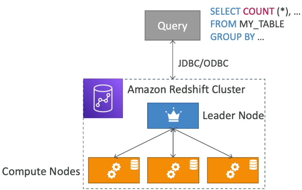
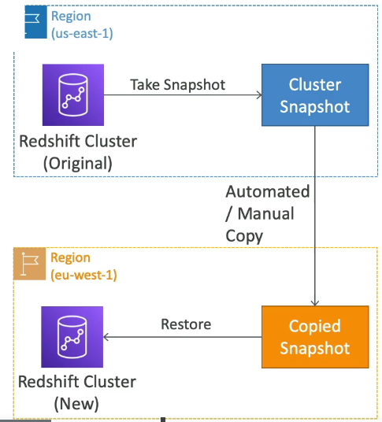
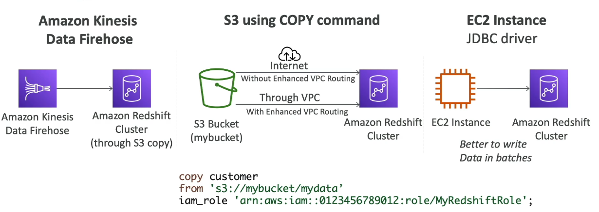
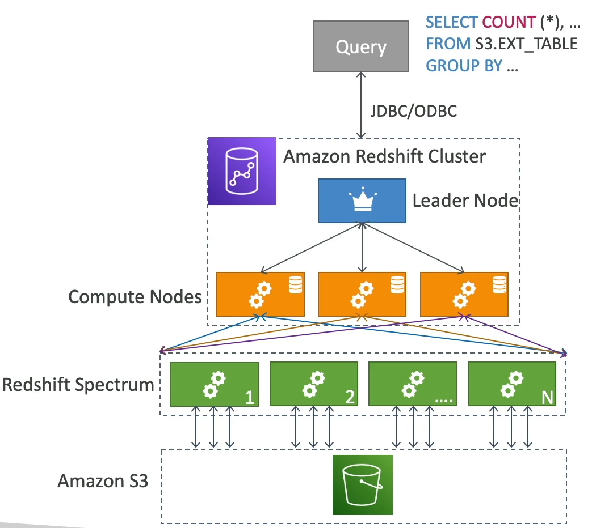

### Amazon Redshift

* Redshift is based on PostgreSQL, but **it's not used for OLTP(Online Transaction Processing)**
* **It's OLAP - online analytical processing(analytics and data warehousing)**
* 10x better performance than other data warehouses, scale to Peta Bytes of data.
* **Columnar** storage of data & parallel query engine
* Pay as you go based on the instance provisioned 
* Has SQL interface for performing the queries
* BU tools such as Amazon Quickshift ot Tableau integrate with it
* vs Athena: faster queries / joins/ aggregations thanks to indexes

#### Redshift Cluster

* Leader node: for query planning, results aggregation
* Compute node: for performing the queries, send result to leader
* You provision the node size in advance
* You can use Reserved Instances for cost savings.

#### Redshift - Snapshots & DR 

* **Redshift has Multi-AZ mode for some clusters**
* Snapshots are point-in-time backups of a cluster, stored internally in S3
* Snapshots are incremental(only what has changed in saved)
* You can restore a snapshot into a **new cluster**
* Automated: every 8 hours, every 5 GB, or on a schedule. Set retention
* Manual: snapshot is retained until you delete it.

* You can configure Amazon Redshift to automatically copy snapshots(automated or manual) of a cluster to another AWS Region

#### Loading data into Redshift

#### Redshift Spectrum

* Query data that is already in S3 without loading it
* **Must have a Redshift Cluster available to start the query**
* The query is then submitted to thousands of Redshift Spectrum nodes.

