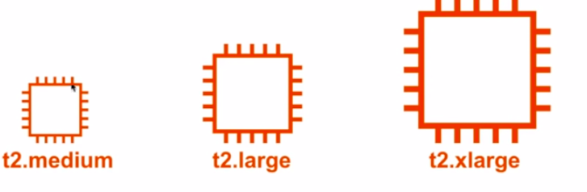
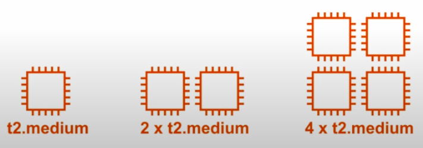

[8:46:26]
### Scale Up and Scale Out

When utilization increases, and we are reaching capacity we can:

### Scale-up(Vertical Scaling)

Increase the size of instances
* Simpler to manage
* Lower availability(if a single instance fails service becomes unavailable)

### Scale out(Horizontal Scaling)

Adding more of the same

* More complexity to manage
* Higher availability(if a single instance fail it doesn't matter)

You will generally want to **scale out** and **then up** to balance complexity vs availability
