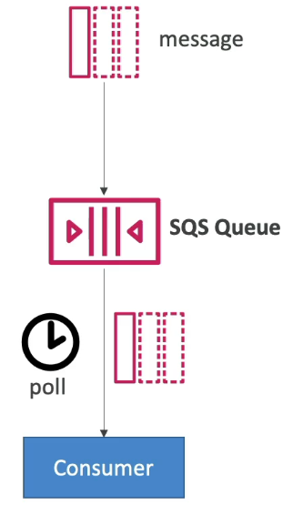
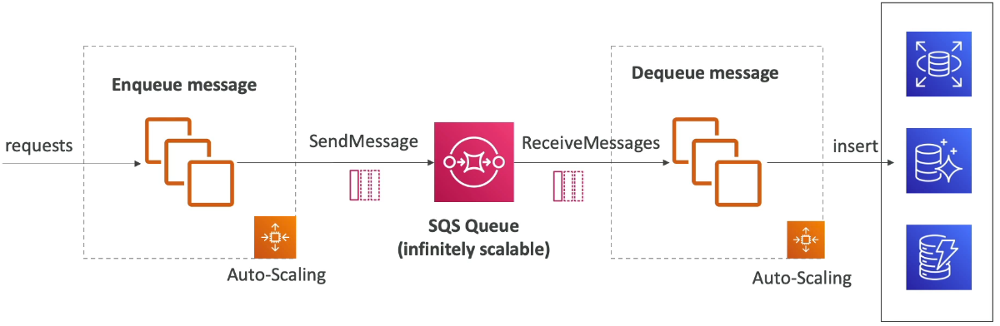
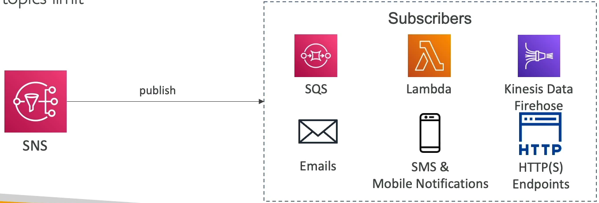

<!-- TOC -->
  * [Simple Queue Service(SQS)](#simple-queue-servicesqs)
    * [What is queue?](#what-is-queue)
    * [Producing Message](#producing-message)
    * [Consuming Messages](#consuming-messages)
    * [Multiple EC2 Instances Consumers](#multiple-ec2-instances-consumers)
    * [SQS with Auto Scaling Group(ASG)](#sqs-with-auto-scaling-groupasg)
    * [SQS to decouple between application tiers](#sqs-to-decouple-between-application-tiers)
    * [SQS - Security](#sqs---security)
    * [Message Visibility Timeout](#message-visibility-timeout)
    * [Long Polling](#long-polling)
    * [FIFO Queue](#fifo-queue)
    * [SQS with Auto Scaling Group(ASG)](#sqs-with-auto-scaling-groupasg-1)
  * [SQS as a buffer to database writes](#sqs-as-a-buffer-to-database-writes)
  * [Amazon SNS](#amazon-sns)
    * [SNS - How to publish](#sns---how-to-publish)
    * [SNS - Security](#sns---security)
  * [SNS + SQS: Fan out](#sns--sqs-fan-out)
    * [Application: S3 Events to multiple queues](#application-s3-events-to-multiple-queues)
    * [Application: SNS to Amazon S3 through Kinesis Data Firehose](#application-sns-to-amazon-s3-through-kinesis-data-firehose)
    * [SNS - FIFO Topic](#sns---fifo-topic)
    * [Message Filtering](#message-filtering)
<!-- TOC -->

### Simple Queue Service(SQS)

#### What is queue?

* Fully managed service, used to **decouple application**
* Attributes:
  * Unlimited throughput, unlimited number of message in queue
  * Default retention of messages: 4 days maximum of 14 days
  * Low Latency(< 10 ms on publish and receive)
  * Limitation of 256KB per message sent

* Can have duplicate messages(at least once delivery, occasionally)
* Can have out of order messages(best effort ordering)

#### Producing Message

* Produced to SQS using the SDK(SendMessage API)
* The message is **persisted** in SQS until a consumer deletes it
* Message retention: default 4 days, up to 14 days

* Example: send an order to be processed
  * Order id
  * Customer id
  * Any attributes you want

* SQS standard: unlimited throughput

#### Consuming Messages

* Consumers(running on EC2 instances, servers, or AWS Lambda)...
* Poll SQS for messages(receive up to 10 messages at a time)
* Process the message(example: insert the message into an RDS database)
* Delete the message using the DeleteMessage API

#### Multiple EC2 Instances Consumers

* Consumer receive and process messages in parallel
* Atl east once delivery
* Best effort message ordering
* Consumers delete messages after processing them
* We can scale consumers horizontally to improve throughput of processing.

#### SQS with Auto Scaling Group(ASG)

* Consumers will be running EC2 instances inside an Auto Scaling Group and they will be polling for messages from the SQS queue
* This Auto-scaling group has to scaling based on the metric that is available on Cloud Watch(i.e: ApproximateNumberOfMessages)

#### SQS to decouple between application tiers

* Front end send a message into an SQS queue
* Backend will process the message from this queue
* This architecture we can scale both frontend and backend independently

#### SQS - Security

* Encryption:
  * In-flight encryption using HTTPS API
  * At-rest encryption using KMS keys
  * Client-side encryption if the client wants to perform encryption/decryption itself
* Access Controls: IAM policies to regulate access to the SQS API
* SQS Access Policies(similar to S3 bucket policies):
  * Useful for cross-account access to SQS queues
  * Useful for allowing other service(SNS, S3) to write to an SQS queue

#### Message Visibility Timeout

* After a message is polled by a consumer, it becomes invisible to other consumers
* By default, the "message visibility timeout" is **30 seconds**
* That means the message has 30 seconds to be processed.
* After the message visibility timeout is over, the message is "visible" is SQS

* If a message is not processed within the visibility timeout, it will be processed **twice**
* A consumer could call the **ChangeMessageVisibility** API to get more time
* If visibility timeout is high, and consumer crashes, re-processing will take time
* If visibility timeout is too low(second), we may get duplicates

#### Long Polling

* When a consumer requests messages from the queue, it can optionally "wait" for messages to arrive if there are none in the queue.
* This is called Long Polling
* **LongPolling decreases the number of API calls made of SQS while increasing the efficiency and latency of your application**
* The wait time can be between 1 sec to 20 sec(20 sec preferable)
* Long Polling is preferable to Short Polling
* Long polling can be enabled at the queue level or at the API level using **WaitTimeSeconds**

#### FIFO Queue

* Ordering of messages in the queue

* Limited throughput: 300 msg/s without batching, 3000 msg/s with
* Exactly-once send capability(by removing duplicates)
* Messages are processed in order by the consumer

#### SQS with Auto Scaling Group(ASG)

* Based on the metric `ApproximateNumberOfMessages` in `CloudWatch` alarm the `ASG` can scale up and down the `ec2` instances 

### SQS as a buffer to database writes

* By using SQS as a buffer, we don't miss any request during the high load, since we delete messages only if system process it.

### Amazon SNS

* What if you want to send one message to many receivers

* The "event producer" only sends message to one SNS topic
* As many "event receivers"(subscriptions) as we want to listen to the SNS topic notifications.
* Each subscriber to the topic will get all the message(note: new feature to filter messages)
* Up to 12,500,000 subscriptions per topic
* 100,000 topics limit

* Many AWS services can send data directly to SNS for notifications

#### SNS - How to publish

* Topic Publish(using the SDK)
  * Create a topic
  * Create one or many subscription(or many)
  * Publish to the topic
* Direct Publish(for mobile apps SDK)
  * Create a platform application
  * Create a platform endpoint
  * Publish to the platform endpoint
  * Works with Google GCM, Apple APNS, Amazon ADM...

#### SNS - Security

* **Encryption**:
  * In-flight encryption using HTTPS API
  * At-rest encryption using KMS keys
  * Client-side encryption if the client wants to perform encryption/decryption itself

* **Access Controls**: IAM policies to regulate access to the SNS API

* **SNS Access Policies**(similar to S3 bucket policies)
  * Useful for cross-account access to SNS topics
  * Useful for allowing other services(S3...) to write to an SNS topic

### SNS + SQS: Fan out

* Push once in SNS, receive in all SQS queues that are subscribers
* Fully decoupled, no data loss
* SQS allows for: data persistence, delayed processing and retries of work
* Ability to add more SQS subscribers over time.
* Make sure your SQS queue **access policy** allows for SNS to write
* Cross-Region Delivery: works with SQS Queues in other regions

#### Application: S3 Events to multiple queues

* For the same combination of: **event type** and **prefix**(e.g. images/) you can only have one S3 Event rule
* If you want to send the same S3 event to many SQS queues, use fan-out

#### Application: SNS to Amazon S3 through Kinesis Data Firehose

* SNS can send to Kinesis, and therefore we have the following solution architecture

#### SNS - FIFO Topic

* FIFO - First In First Out(ordering of messages in the topic)
* Similar features as SQS FIFO:
  * **Ordering** by Message Group ID(all messages in the same group are ordered)
  * **Deduplication** using Deduplication ID or Content Based Deduplication
* **Can have SQS standard and FIFO queues as subscribers**
* Limited throughtput(same throughput as SQS FIFO)

* In case you need fan out + ordering + deduplication

#### Message Filtering

* JSON policy used to filter messages sent to SNS topic's subscriptions
* If a subscription doesn't have a filter policy, it receives every message

