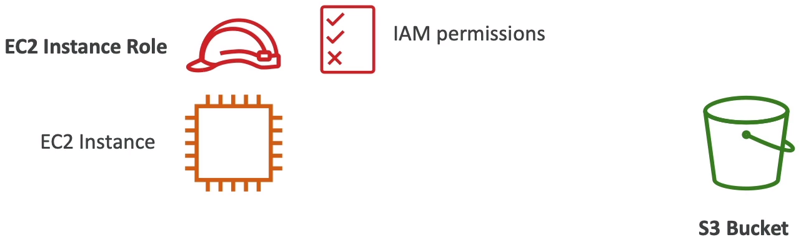
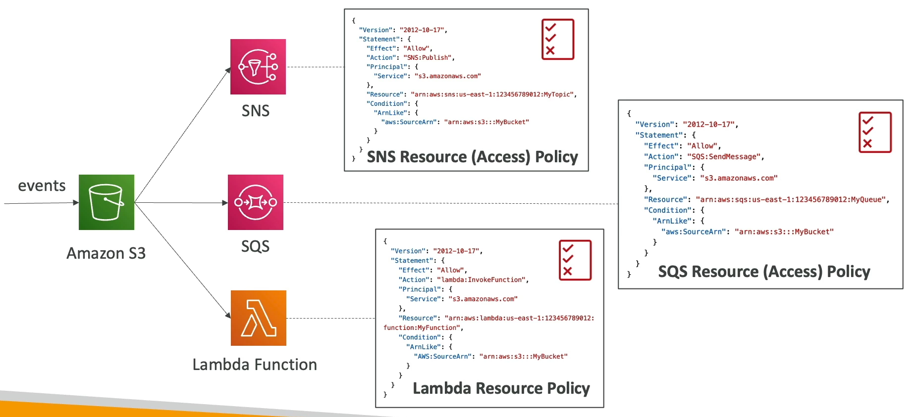
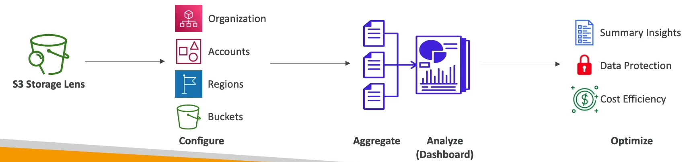
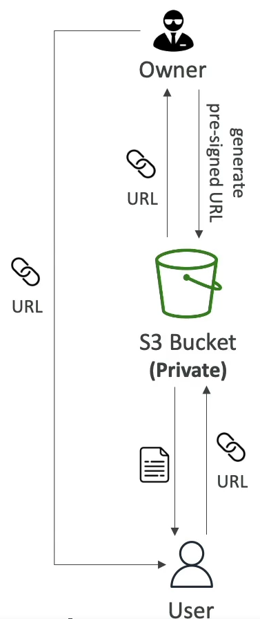

<!-- TOC -->
  * [Amazon S3 Use cases](#amazon-s3-use-cases)
  * [Amazon S3 - Buckets](#amazon-s3---buckets)
    * [Amazon S3 - Objects](#amazon-s3---objects)
    * [Amazon S3 - Objects(cont.)](#amazon-s3---objectscont)
    * [Amazon S3 - Security](#amazon-s3---security)
    * [S3 Bucket Policies](#s3-bucket-policies)
    * [Public Access - Use Bucket Policy](#public-access---use-bucket-policy)
    * [User Access to S3 - IAM Permissions](#user-access-to-s3---iam-permissions)
    * [EC2 instance access - Use IAM Roles](#ec2-instance-access---use-iam-roles)
    * [Bucket settings for Block Public Access](#bucket-settings-for-block-public-access)
  * [Amazon S3 - Static Website Hosting](#amazon-s3---static-website-hosting)
  * [Amazon S3 - Versioning](#amazon-s3---versioning)
  * [Amazon S3 - Replication (CRR & SRR)](#amazon-s3---replication-crr--srr)
    * [S3 - Replication Notes](#s3---replication-notes)
  * [S3 Storage Classes](#s3-storage-classes)
    * [S3 Durability and Availability](#s3-durability-and-availability)
    * [S3 Standard - General Purpose](#s3-standard---general-purpose)
    * [S3 Storage classes - Infrequenct Access](#s3-storage-classes---infrequenct-access)
    * [Amazon S3 Glacier Storage Classes](#amazon-s3-glacier-storage-classes)
    * [S3 Intelligent Tiering](#s3-intelligent-tiering)
  * [Amazon S3 - Moving between Storage Classes](#amazon-s3---moving-between-storage-classes)
    * [Lifecycle Rules](#lifecycle-rules)
    * [Amazon S3 - Lifecycle Rules(Scenario 1)](#amazon-s3---lifecycle-rulesscenario-1)
    * [Amazon S3 - Lifecycle Rules(Scenario 2)](#amazon-s3---lifecycle-rulesscenario-2)
    * [Amazon S3 Analytics - Storage Class Analysis](#amazon-s3-analytics---storage-class-analysis)
  * [S3 Requester Pays](#s3-requester-pays)
  * [S3 Event Notifications](#s3-event-notifications)
    * [S3 Event Notifications - IAM Permissions](#s3-event-notifications---iam-permissions)
    * [S3 Event Notification with Amazon EventBridge](#s3-event-notification-with-amazon-eventbridge)
  * [S3- Baseline Performance](#s3--baseline-performance)
    * [Multi-part upload:](#multi-part-upload)
    * [S3 transfer acceleration](#s3-transfer-acceleration)
    * [S3 Byte-Range Fetches](#s3-byte-range-fetches)
  * [S3 Select & Glacier Select](#s3-select--glacier-select)
  * [S3 Batch Operations](#s3-batch-operations)
  * [S3 - Storage Lens](#s3---storage-lens)
    * [Storage Lens - Default Dashboard](#storage-lens---default-dashboard)
    * [Storage Lens - Metrics](#storage-lens---metrics)
    * [Storage Lens - Free vs Paid](#storage-lens---free-vs-paid)
  * [Amazon S3 - Object Encryption](#amazon-s3---object-encryption)
    * [Amazon S3 Encryption - SSE S3](#amazon-s3-encryption---sse-s3)
    * [Amazon S3 Encryption - SSE-KMS](#amazon-s3-encryption---sse-kms)
      * [SSE-KMS Limitation](#sse-kms-limitation)
    * [Amazon S3 Encryption - SSE-C](#amazon-s3-encryption---sse-c)
    * [Amazon S3 Encryption - Client Side Encryption](#amazon-s3-encryption---client-side-encryption)
    * [Amazon S3 - Encryption in transit(SSL/TLS)](#amazon-s3---encryption-in-transitssltls)
    * [Amazon S3 - Force Encryption in transit aws:SecureTransport](#amazon-s3---force-encryption-in-transit-awssecuretransport)
  * [Default Encryption vs Bucket Policies](#default-encryption-vs-bucket-policies)
  * [What is CORS?](#what-is-cors)
    * [Amazon S3 - CORS](#amazon-s3---cors)
  * [Amazon S3 - MFA Delete](#amazon-s3---mfa-delete)
  * [S3 Access Logs](#s3-access-logs)
    * [S3 Access Logs: Warning](#s3-access-logs-warning-)
  * [Amazon S3 - Pre Signed URLs](#amazon-s3---pre-signed-urls)
  * [S3 Glacier Vault Lock](#s3-glacier-vault-lock)
    * [S3 Object Lock(versioning must be enabled)](#s3-object-lockversioning-must-be-enabled)
    * [Access Points](#access-points)
    * [S3 - Access Points - VPC Origin](#s3---access-points---vpc-origin)
  * [S3 Object Lambda](#s3-object-lambda)
<!-- TOC -->

### Amazon S3 Use cases

* Backup and storage
* Disaster recovery
* Archive
* Hybrid Cloud storage
* Application hosting
* Media hosting
* Data lakes & big data analytics
* Software delivery
* Static website

### Amazon S3 - Buckets

* Amazon S3 allows people to store objects(files) in "buckets" (directories)
* Buckets must have a **globally unique name(across all regions all accounts)**
* Buckets are defined at the region level
* S3 looks like a global service but buckets are created in a region
* Naming convention
  * No uppercase, No underscore
  * 3-63 characters long
  * Not an IP
  * Must start with lowercase letter or number
  * Must NOT start with the prefix **xn--**
  * Must NOT end with the suffix **-s3alias**

#### Amazon S3 - Objects

* Objects(files) have a Key
* The key is the **FULL** path:
  * s3://my-bucket/my_file.txt
  * s3://my-bucket/my_folder1/another_folder/my_file.txt
* The key is composed of prefix + object name
  * s3://my-bucket/my_folder1/another_folder/my_file.txt
* There's no concept of "directories" within buckets
  (although the UI will trick you to think otherwise)
* Just keys with very long names that contain slashes("/")

#### Amazon S3 - Objects(cont.)

* Object values are the content of the body:
  * Max. Object Size is 5TB(5000GB)
  * If uploading more than 5GB, must use "multi-part upload"
* Metadata(list of text key / value pairs - system or user metadata)
* Tags (Unicode key / value pair - up to 10) - useful for security / lifecycle
* Version ID (if versioning is enabled)

#### Amazon S3 - Security

* User-Based
  * IAM Policies - which API calls should be allowed for a specific user from IAM
  
* Resource-Based
  * Bucket Policies - bucket wide rules from the S3 console - allows cross account
  * Object Access Control List(ACL) - finer grain(can be disabled)
  * Bucket Access Control List(ACL) - less common(can be disabled)

* Note: an IAM principal can access an S3 object if
  * The user IAM permission ALLOW it OR the resource policy ALLOWS it
  * AND there's no explicit DENY

* Encryption: encrypt objects in Amazon S3 using encryption keys

#### S3 Bucket Policies

* JSON based policies
  * Resources: buckets and objects
  * Effect: Allow/Deny
  * Actions: Set of API to Allow or Deny
  * Principal: The account or user to apply the policy to
  
* Use S3 bucket for policy to
  * Grant public access to the bucket
  * Force objects to be encrypted at upload
  * Grant access to another account(Cross Account)

```json
{
  "Version": "2012-10-17",
  "Statement": [
    {
      "Sid": "PublicRead",
      "Effect": "Allow",
      "Principal": "*",
      "Action": [
        "s3:GetObject"
      ],
      "Resource": [
        "arn:aws:s3:::examplebucket/*"
      ]
    }
  ]
}
```

#### Public Access - Use Bucket Policy

* Use can you bucket policy to allow public access for a bucket or to allow user from different account to access the bucket


#### User Access to S3 - IAM Permissions

* To allow a user to access the bucket use IAM user policy


#### EC2 instance access - Use IAM Roles

* To allow EC2 instance to access the S3 bucket, use IAM roles



#### Bucket settings for Block Public Access


* These settings were created to prevent company data leaks
* If you know your bucket should never be public, leave these on
* Can be set at the account level

### Amazon S3 - Static Website Hosting

* S3 can host static websites and have them accessible on the Internet

* The website URL will be (depending on the region)
  * http://bucket-name.s3-website-aws-region.amazonaws.com
  or 
  * http://bucket-name.s3-website.aws-region.amazonaws.com

* If you get a **403 Forbidden** error, make sure the bucket policy allows public reads!!!

### Amazon S3 - Versioning

* You can version your files in Amazon S3
* It is enabled at the **bucket level**
* Same key overwrite will change the "version": 1,2,3...
* It is best practice to version your buckets
  * Protect against unintended deletes(ability to restore a version)
  * Easy roll back to previous version
* Notes:
  * Any files that is not versioned prior to enabling versioning will have version "null"
  * Suspending versioning does not delete the prevision versions

### Amazon S3 - Replication (CRR & SRR)

* Must enable versioning in source and destination buckets
* **Cross-Region replication** (CRR)
* **Same-Region replication** (SRR)
* Buckets can be in different AWS accounts
* Copying is asynchronous
* Must give proper IAM permissions to S3

* Use cases:
  * CRR - compliance, lower latency access, replication across accounts
  * SRR - log aggregation, live replication between production and test accounts

#### S3 - Replication Notes

* After you enable replication, only new objects are replicated
* Optionally, you can replicate existing objects using **S3 Batch Replication**
  * Replicates existing objects and objects that failed replication

* For DELETE operations
  * **Can replicate delete markers** from source to target(optional setting)
  * Deletions with a version ID are not replicated(to avoid malicious deletes)

* **There is no "chaining" of replication**
  * If bucket 1 has replication into bucket 2, which has replication into bucket 3
  * Then objects created in bucket 1 are not replicated to bucket 3

### S3 Storage Classes

* Amazon S3 Standard - General Purpose
* Amazon S3 Standard-Infrequent Access(IA)
* Amazon S3 One Zone-Infrequent Access
* Amazon S3 Glacier Instant Retrieval
* Amazon S3 Glacier Flexible Retrieval
* Amazon S3 Glacier Deep Archive
* Amazon S3 Intelligent Tiering

* Can move between classes manually or using S3 lifecycle configurations

#### S3 Durability and Availability

* Durability
  * High durability(99.99999999%, 11 9's) of object across multiple AZ
  * If you store 10,000,000 objects with Amazon S3, you can on average expect to incur a loss of a single object once every 10,000 years
  * Same for all storage classes
  
* Availability
  * Measures how readily available a service is
  * Varies depending on storage class
  * Example: S3 standard has 99.99 availability = not available 53 minutes a year

#### S3 Standard - General Purpose

* 99.99% Availability
* Used for frequently accessed data
* Low latency and high throughput
* Sustain 2 concurrent facility failures

* Use cases: Big Data analytics, mobile & gaming applications, content distribution...

#### S3 Storage classes - Infrequenct Access

* For data that is less frequently accessed but required rapid access when needed
* Lower cost than S3 Standard

* **Amazon S3 Standard-Infrequent Access(S3 Standard-1A)**
  * 99.9% Availability
  * Use-case: Disaster Recovery, backup
* **Amazon S3 One Zone-Infrequent Access(S3 One Zone-IA)**
  * High durability(9.999999999%) in a single AZ; data lost when AZ is destroyed
  * 99.5% Availability
  * Use-cases: Storing secondary backup copies of on-premises data, or data you can re-create

#### Amazon S3 Glacier Storage Classes

* Low-cost object storage meant for archiving/backup
* Pricing: price for storage + object retrieval cost

* **Amazon S3 Glacier Instant Retrieval**
  * Millisecond retrieval, great for data accessed once a quarter
  * Minimum storage duration for 90 days
* **Amazon S3 Glacier Flexible Retrieval**(formerly Amazon S3 Glacier)
  * Expedited(1 to 5 minutes), Standard(3 to 5 hours), Bulk(5 to 12 hours) - free
  * Minimum storage duration of 90 days
* **Amazon S3 Glacier Deep Archive - for long term storage**:
  * Standard(12 hours), Bulk(48 hours)
  * Minimum storage duration of 180 days

#### S3 Intelligent Tiering

* Small monthly monitoring and auto-tiering fee
* Moves objects automatically between Access Tiers based on usage
* There are no retrieval charges in S3 Intelligent-Tiering

* Frequent Access Tier(automatic): default tier
* Infrequent Access Tier(automatic): objects not accessed for 30 days
* Archive Instant Access Tier(automatic): objects not accessed for 90 days
* Archive Access tier(optional): configurable from 90 days to 700+ days
* Deep Archive Access tier(optional): config from 180 days to 700+ days

### Amazon S3 - Moving between Storage Classes

* You can transition object between storage classes

* For infrequently accessed object move them to **Standard IA**
* For archive objects that you don't need fast access to, move them to **Glacier or Glacier Deep Archive**
* Moving objects can be automated using a **Lifecycle Rules**


#### Lifecycle Rules

* **Transition Actions** - configure objects to transition to another storage class
  * Move objects to Standard IA class 60 days after creation
  * Move to Glacier for archiving after 6 months

* **Expiration actions** - configure objects to expire(delete) after some time
  * Access log files can be set to delete after 365 days
  * Can be used to delete old versions of files(if versioning is enabled)
  * Can be used to delete incomplete Multi-part uploads

* Rules can be created for a certain prefix(example: s3://mybucket/mp3/*)
* Rules can be created for certain object tags(example: Department finance)

#### Amazon S3 - Lifecycle Rules(Scenario 1)

* Your application on EC2 creates images thumbnails after profile photos are uploaded to Amazon S3. These thumbnails can be easily recreated, and only need to kept for 60 days. The source images should be able to be immediately retrieved for these 60 days, and afterward, the use can wait up to 6 hours. How would you design this?

* S3 source images can be on **Standard**, with a lifecycle configuration to transition them to **Glacier** after 60 days.
* S3 thumbnails can be on **One-Zone IA**, with a lifecycle configuration to expire them(delete them) after 60 days.

#### Amazon S3 - Lifecycle Rules(Scenario 2)

* A rule in your company states that you should be able to recover your deleted S3 objects immediately for 30 days, although this may happen rarely. After this time, and for up to 365 days, deleted objects should be recoverable within 48 hours.

* Enabled **S3 versioning**, in order to have object versions, so that "deleted objects" are in fact hidden by a "delete marker" and can be recovered.
* Transition the "non-current versions" of the object to **Standard IA**
* Transition afterward the "non-current versions" to **Glacier Deep Archive**

#### Amazon S3 Analytics - Storage Class Analysis

* Help you decide when to transition objects to right class
* Recommendation for **Standard** and **Standard IA**
  * Does NOT work for One-Zone IA or Glacier
* Report is updated daily
* 24 to 48 hours to start seeing data analysis
* Good first step to put together Lifecycle Rules(or improve them)


### S3 Requester Pays

* In general, bucket owners pay for all Amazon S3 storage and data transfer cost associated with their bucket
* With **Requester Pays Bucket**, the requester instead of the bucket owner pays the cost of the request and the data download from the bucket.
* Helpful when you want to share large dataset with other account.
* The requester must be authenticated in AWS(cannot be anonymous)


### S3 Event Notifications

* S3:ObjectCreated, S3:ObjectRemoved, S3:ObjectRestore, S3:Replication,...
* Object name filtering is possible(*.jpg)
* Use case: generate thumbnails of images uploaded to S3
* Can create as many "S3 events" as desired

* S3 event notifications typically deliver events in seconds but can sometime take a minute or longer


#### S3 Event Notifications - IAM Permissions

* To send event to SNS, SQS or Lambda we need to create Resource Policy, which allow S3 to send notification to this services



#### S3 Event Notification with Amazon EventBridge

* From S3 you can send notification to EventBridge and from there you can send notification to 18 different amazon service as destination


* **Advanced filtering** options with JSON rules(metadata, object size, name...)
* **Multiple Destinations** - ex Step Functions, kinesis Streams / Firehose...
* **EventBridge Capabilities** - Archive, Replay Events, Reliable delivery

### S3- Baseline Performance

* Amazon S3 automatically scales to high request rates, latency 100-200 ms
* Your application can achieve at least 3,500 PUT/COPY/POST/DELETE or 5,500 GET/HEAD requests per second per prefix in a bucket.
* There is no limits to the number of prefixes in a bucket
* Example(object path => prefix):
  * bucket/folder1/sub1/file => /folder1/sub1/
  * bucket/folder1/sub2/file => /folder1/sub2/
  * bucket/1/file => /1/
  * bucket/2/file => /2/
* If you spread reads across all four prefixes evenly, you can achieve 22,000 requests per second for GET and HEAD

#### Multi-part upload:

* recommended for file > 100MB, must use for files > 5GB
* Can help parallelize uploads(speed up transfers)


#### S3 transfer acceleration

* Increase transfer speed by transferring file to an AWS edge location which will forward the data to the S3 bucket in the target region
* Compatible with multipart upload


#### S3 Byte-Range Fetches

* Parallelize GETs by requesting specific byte ranges
* Better resilience in case of failure
* Can be used to speed up downloads


* Can be used to retrieve only partial data(for example the head of a file)


### S3 Select & Glacier Select

* Retrieve less data using SQL by performing **server-side filtering**
* Can filter by rows & columns(simple SQL statements)
* Less network transfer, less CPU cost client-side


### S3 Batch Operations

* Perform bulk operations on existing S3 objects with a single request, example:
  * Modify object metadata & properties
  * Copy objects between S3 buckets
  * Encrypt un-encrypted objects
  * Modify ACLs, tag
  * Restore objects from S3 Glacier
  * Invoke Lambda function to perform custom action on each object
* A job consists of a list of objects, action to perform, and optional parameters
* S3 Batch operations manages retries, tracks progress, send completion notification, generate reports...
* You can use S3 inventory to get object list and use S3 select to filter your objects


### S3 - Storage Lens

* Understand, analyze and optimize storage across entire AWS organization
* Discover anomalies, identify cost efficiencies, and apply data protection best practices across AWS organization(30 days usage & activity metrics)
* Aggregate data for organization, specific accounts, regions, buckets, or prefixes
* Default dashboard or create your own dashboards
* Can be configured to export metrics daily to an S3 bucket(CSV, Parquet)



#### Storage Lens - Default Dashboard

* Visualize summarized insights and trends for both free and advanced metrics
* Default dashboard shows Multi-Region and Multi-Account data
* Preconfigured by Amazon S3
* Can't be deleted, but can be disabled


#### Storage Lens - Metrics

* **Summary Metrics**
  * General insights about your S3 storage
  * StorageBytes, Object Count...
  * Use-cases: identify the fastest-growing(or not used) buckets and prefixes
* **Cost-optimization Metrics**
  * Provide insights to manage and optimize your storage costs
  * NonCurrentVersionStorageBytes, IncompleteMultipartUploadStorageBytes...
  * Use cases: identify buckets with incomplete multipart uploaded older than 7 days, identify which objects could be transitioned to lower cost storage class.
* **Data-Protection Metrics**
  * Provide insights for data protection features
  * VersioningEnabledBucketCount, MFADeleteEnabledBucketCount, SSEKMSEnabledBucketCount, CrossRegionReplicationRuleCount...
  * Use-case: identify buckets that aren't following data-protection best practices
* **Access-Management Metrics**
  * Provide insights for S3 Object ownership
  * ObjectOwnershipBucketOwnerEnforcedBucketCount...
  * Use-cases: identify which object ownership setting your buckets use
* **Event Metrics**
  * Provide insights for S3 Event Notifications
  * EventNotificationEnabledBucketCount(identify which buckets have S3 Event Notifications configured)
* **Performance Metrics**
  * Provide insights for S3 Transfer Acceleration
  * TransferAccelerationBucketCount(identify which buckets have S3 transfer acceleration enabled)
* **Activity Metrics**
  * Provide insights about how your storage is requested
  * AllRequests, GetRequests, PutRequests, ListRequests, BytesDownloads...
* **Detailed Status Code Metrics**
  * Provide insights for HTTP status codes
  * 200OKStatusCount, 403ForbiddenErrorCount, 404NotFoundErrorCount...

#### Storage Lens - Free vs Paid

* **Free Metrics**
  * Automatically available for all customers
  * Contains around 28 usage metrics
  * Data is available for queries for 14 days
* **Advanced Metrics and Recommendations**
  * Additional paid metrics and features
  * **Advanced metrics** - Activity, Advanced Cost Optimization, Advanced Data Protection, Status Code
  * **CloudWatch Publishing** - Access metrics in CloudWatch without additional charges
  * **Prefix Aggregation** - Collect metrics at the prefix level
  * Data is available for queries for 15 months.


### Amazon S3 - Object Encryption

* You can encrypt objects in S3 buckets using one of 4 methods
* **Server-Side Encryption(SSE)**
  * **Server-side Encryption with Amazon S3-Managed Keys(SSE-S3)** - Enabled by default
    * Encrypt S3 object using keys handled, managed and owned by AWS
  * **Server-side Encryption with KMS Keys stored in AWS KMS(SSE-KMS)**
    * Leverage AWS Key Management Service(AWS KMS) to manage encryption keys
  * **Server-side Encryption with Customer-Provided Keys(SSE-C)**
    * When you want to manage your own encryption keys
* **Client Side Encryption**

#### Amazon S3 Encryption - SSE S3

* Encryption using keys handled, managed and owned by AWS
* Object is encrypted server-side
* Encryption type is **AES-256**
* Must set header **"x-amz-server-side-encryption":"AES256"**
* **Enabled by default for new buckets & new objects**


#### Amazon S3 Encryption - SSE-KMS

* Encryption using keys handled and managed by AWS KMS(key management service)
* KMS advantages: user control + audit key usage using CloudTrail
* Object is encrypted server side
* Must set header "x-amz-server-side-encryption":"aws:kms"


##### SSE-KMS Limitation

* If you use SSE-KMS, you may be impacted by the KMS limits
* When you upload, it calls the **GenerateDataKey** KMS API
* When you download, it calls the **Decrypt** KMS API
* Count towards the KMS quota per second(5500, 10000, 30000 req/s based on region)
* You can request a quota increase using the Service Quotas Console.


#### Amazon S3 Encryption - SSE-C

* Server-side Encryption using keys fully managed by the customer outside of AWS
* Amazon S3 does not store the encryption key you provide
* **HTTPS** must be used
* **Encryption key must be provided in HTTP headers, for every HTTP request made**


#### Amazon S3 Encryption - Client Side Encryption

* Use client libraries such as **Amazon S3 Client-Side Encryption Library**
* Clients must encrypt data themselves before sending to Amazon S3
* Clients must decrypt data themselves when retrieving from Amazon S3
* Customer fully manages the keys and encryption cycle.


#### Amazon S3 - Encryption in transit(SSL/TLS)

* Encryption in flight is also called SSL/TLS

* Amazon S3 exposes two endpoints:
  * HTTP Endpoint - non encrypted
  * HTTPS Endpoint - encrypted in flight

* HTTPS is recommended
* HTTPS is mandatory for SSE-C
* Most clients would use the HTTPS endpoint by default

#### Amazon S3 - Force Encryption in transit aws:SecureTransport

* To force encryption in transit we need to introduce a bucket policy

```json
{
  "Condition": {
    "Bool": {
      "aws:SecureTransport": "false"
    }
  }
}
```


### Default Encryption vs Bucket Policies

* SSE-S3 encryption is automatically applied to new objects stored in S3 bucket
* Optionally you can force encryption using a bucket policy and refuse any API call to put an S3 object without encryption headers(SSE-KMS or SSE-C)

```json
{
  "version": "2012-10-17",
  "Statement": [
    {
      "Effect": "Deny",
      "Action": "s3:PutObject",
      "Principal": "*",
      "Resource": "arn:aws:s3:::my-bucket/*",
      "Condition": {
        "StringNotEquals": {
          "s3:x-amz-server-side-encryption": "aws:kms"
        }
      }
    }
  ]
}
```

```json
{
  "version": "2012-10-17",
  "Statement": [
    {
      "Effect": "Deny",
      "Action": "s3:PutObject",
      "Principal": "*",
      "Resource": "arn:aws:s3:::my-bucket/*",
      "Condition": {
        "Null": {
          "s3:x-amz-server-side-encryption-customer-algorithm": "true"
        }
      }
    }
  ]
}
```

### What is CORS?

* Cross-Origin Resource Sharing(CORS)
* Origin = scheme(protocol) + host (domain) + port
  * example: https://www.example.com (implied port is 443 for HTTPS, 80 for HTTP)
* Web Browser based mechanism to allow requests to other origins while visiting the main origin
* Same origin: http://example.com/app1 & http://example.com/app2
* Different origins: http://www/example.com & http://other.example.com
* The requests won't be fulfilled unless the other origin allows for the request, using CORS headers(example: Access-Control-Allow-Origin)


#### Amazon S3 - CORS

* If a client makes a cross-origin request on our S3 bucket, we need to enable the correct CORS headers
* You can allow for a specific origin or for *(all origins)


### Amazon S3 - MFA Delete

* **MFA(Multi-Factor Authentication) - ** force users to generate a code on a device(usually a mobile phone or hardware) before doing important operation on S3
* MFA will be required to:
  * permanently delete an object version
  * Suspend versioning on the bucket
* MFA won't be required to:
  * Enable Versioning
  * List deleted version
* To use MFA Delete, Versioning must be enabled on the bucket
* Only the bucket owner(root account) can enable/disable MFA Delete

### S3 Access Logs

* For audit purpose, you may want to log all access to S3 bucket
* Any request made to S3, from any account, authorized or denied will be logged into another S3 bucket
* That data can be analyzed using data analysis tools...
* The target logging bucket must be in the same AWS region

* The log format is at
  https://docs.aws.amazon.com/AmazonS3/latest/userguide/LogFormat.html

#### S3 Access Logs: Warning 

* Do not set you logging bucket to be the monitored bucket
* It will create a logging loop, and your bucket will grow exponentially

### Amazon S3 - Pre Signed URLs

* Generate pre-signed URLs using the S3 console, AWS CLI or SDK
* URL Expiration
  * S3 Console - 1 min up to 720 mins(12 hours)
  * AWS CLI - configure expiration with --expire-in parameter in seconds(default 3600 secs, max.604800 secs ~168 hours)
* Users given a pre-signed URL inherit the permissions of the user that generated the URL for GET/PUT

* Examples:
  * Allow only logged-in users to download a premium video from your S3 bucket
  * Allow an ever-changing list of users to download files by generating URLs dynamically
  * Allow temporarily a user to upload a file to a precise location in your S3 bucket




### S3 Glacier Vault Lock

* Adopt a WORM(Write Once Read Many) model
* Create a Vault Lock Policy
* Lock the policy for future edits
* Helpful for compliance and data retention


#### S3 Object Lock(versioning must be enabled)

* Adopt a WORM(Write Once Read Many) model
* Block an object version deletion for a specified amount of time
* **Retention mode - Compliance**:
  * Object versions can't be overwritten or deleted by any user, including the root user
  * Objects retention modes can't be changed, and retention periods can't be shortened
* **Retention mode - Governance**:
  * Most users can't overwrite or delete an object version or alter its lock settings
  * Some users have special permissions to change the retention or delete the object
* **Retention Period**: protect the object for a fixed period, it can be extended
* **Legal Hold**:
  * **protect the object indefinitely, independent of retention period**
  * can be freely placed and removed using the `s3:PutObjectLegalHold` IAM permission

#### Access Points

* Access Points simplify security management for S3 Buckets
* Each Access Point has:
  * its own DNS name(Internet Origin or VPC origin)
  * an access point policy(similar to bucket policy) - manage security at scale


#### S3 - Access Points - VPC Origin

* We can define the access point to be accessible only from within the VPC
* You must create a **VPC Endpoint** to access the Access Point(Gateway or Interface Endpoint)
* The VPC Endpoint Policy must allow access to the target bucket and Access Point


### S3 Object Lambda

* Use AWS Lambda Functions to change the object before it is retrieved by the caller application
* Only one S3 bucket is needed, on top of which we create **S3 Access Point** and **S3 Object Lambda Access Points**
* Use-cases"
  * Redacting personally identifiable information for analytics or non-production environments
  * Converting across data formats, such as converting XML to JSON
  * Resizing and watermarking images on the fly using caller-specific details, such as the user who requested the object.

