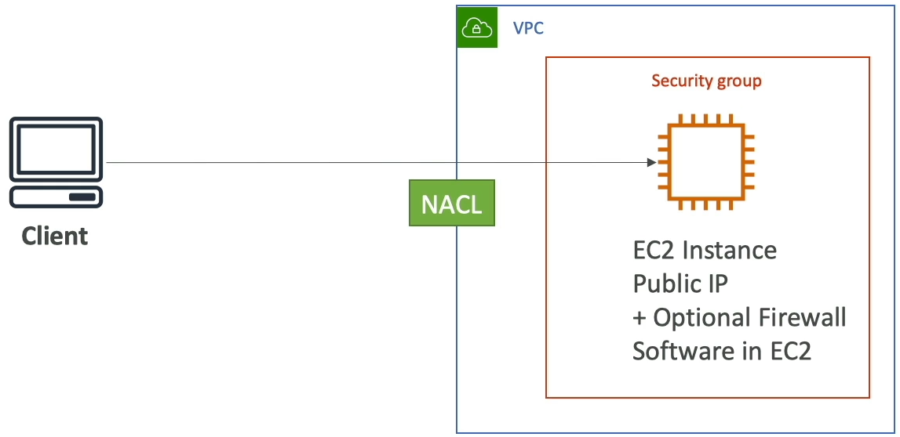
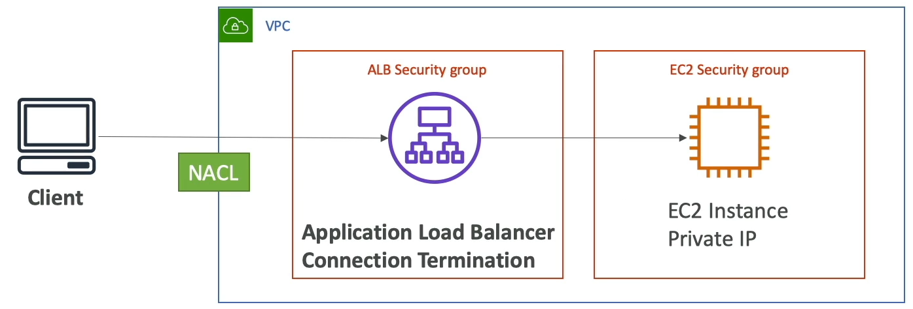
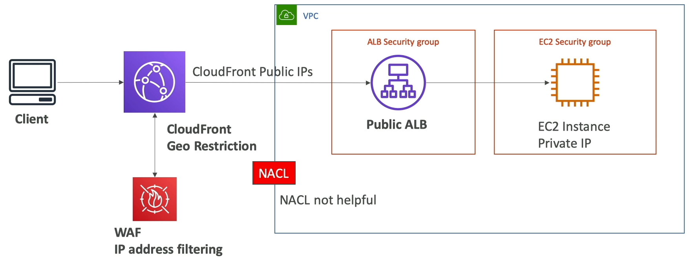

### Blocking an IP Address

* Using NACL can block IP addresses
* Using Security Group one can allow a subset of IP of address
* Optionally using firewall software you block request from client

* Using NACL can block IP addresses
* Using Security Group one can allow a subset of IP of address

* Here NACL is not useful
* Use CloudFront Geo Restriction to block a country
* Can use WAF for IP address filtering