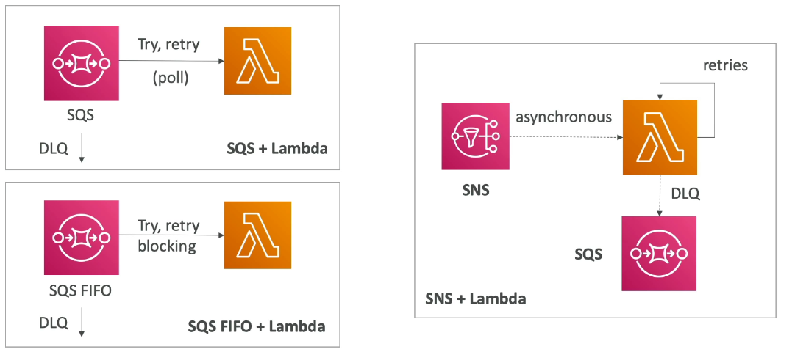
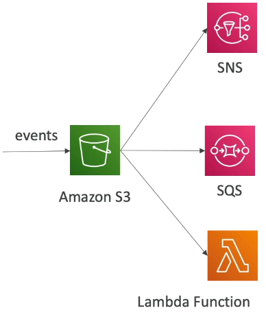
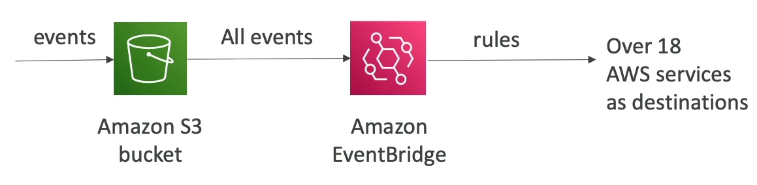
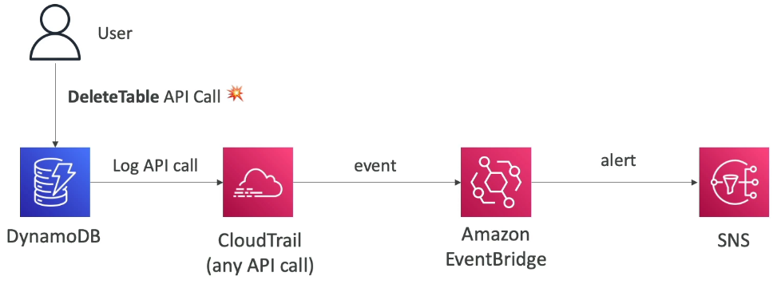
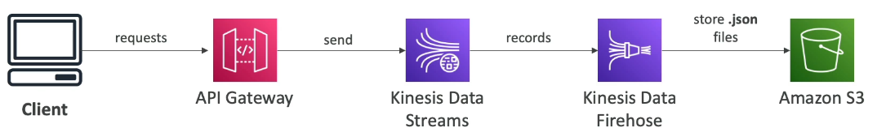

### Lambda, SNS & SQS

### Fan Out Pattern: deliver to multiple SQS

### S3 Event Notifications

* S3:ObjectCreated, S3:ObjectRemoved, S3:ObjectRestore, S3:Replication...
* Object name filtering possible(*.jpg)
* Use case: generate thumbnails of images uploaded to S3
* Can create as many "S3 events" as desired
* S3 event notifications typically deliver events in seconds but can sometimes take a minute or longer

### S3 Event Notification - with Amazon EventBridge

* Advanced filtering options with JSON rules(metadata, object size, name...)
* Multiple Destinations - ex Step Functions, Kinesis Stream / Firehose
* EventBridge Capabilities - Archive, Replay Events, Reliable delivery

### Amazon EventBridge - Intercept API Calls

### API Gateway - AWS Service Integration - Kinesis Data Streams example

