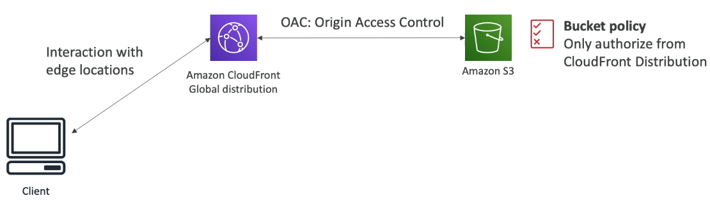
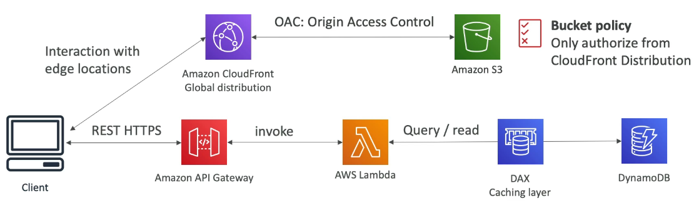
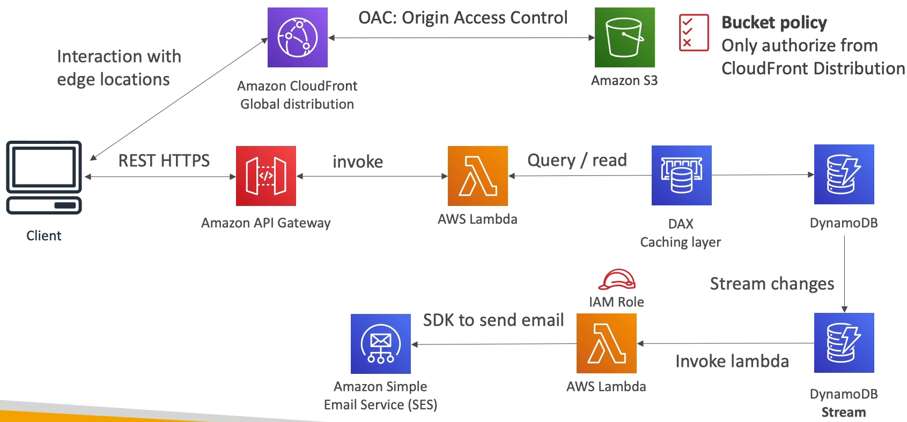
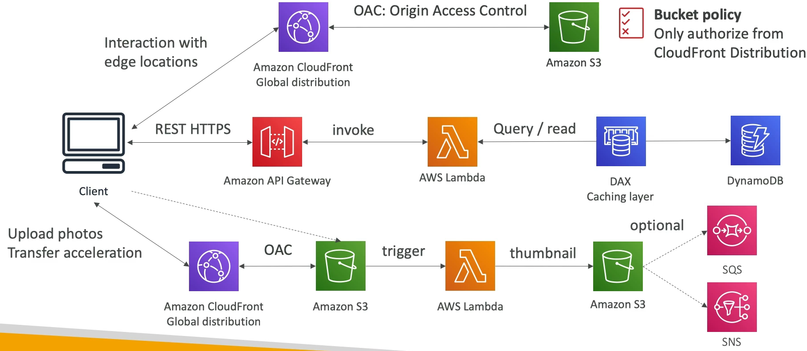

### MyBlog.com

* This website should scale globally.
* Blogs are rarely written, but often read.
* Some of the website is purely static files, the rest is a dynamic REST API.
* Caching must be implemented where possible.
* Any new users that subscribes should receive a welcome email.
* Any photo uploaded to the blog should have a thumbnail generated.

#### Serving static content, globally securely

#### Adding a public serverless REST API

#### User Welcome email Flow

#### Thumbnail Generation Flow

#### Summary

* We've seen static content being distributed using CloudFront with S3
* The REST API was serverless, didn't need Cognito because public
* We leveraged a Global DynamoDB table to serve the data globally
* (We could have used Aurora Global Database)
* We enabled DynamoDB streams to trigger a Lambda function
* The lambda function had to IAM role which could use SES
* SES(Simple Email Service) was used to send emails in a serverless way
* S3 can trigger SQS/SNS/Lambda to notify the events