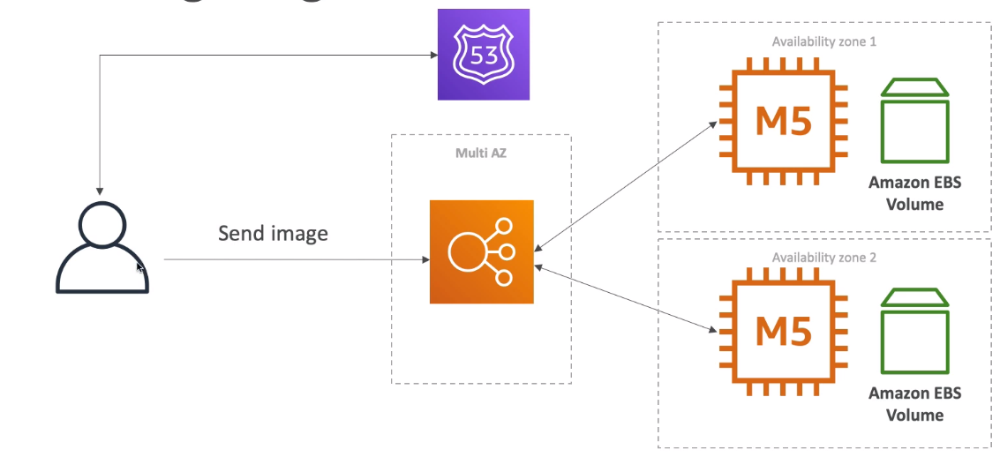
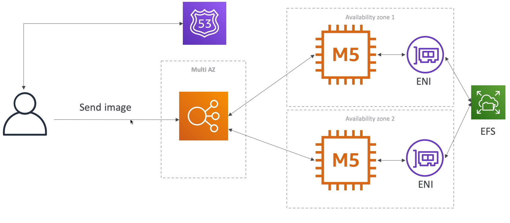

### MyWordPress.com

* We are trying to create a fully scalable WordPress website
* We want that website to access and correctly display picture uploads
* Our user data, and the blog content should be stored in a MySQL database.

#### Storing image with EBS

* When we add more EC2 instances, storing the images in EBS volume won't work since if you store in the image in EBS, other EC2 instance won't be able to access it.

#### Store image in EFS

* This way allow all the EC2 instance to access the image from a single location